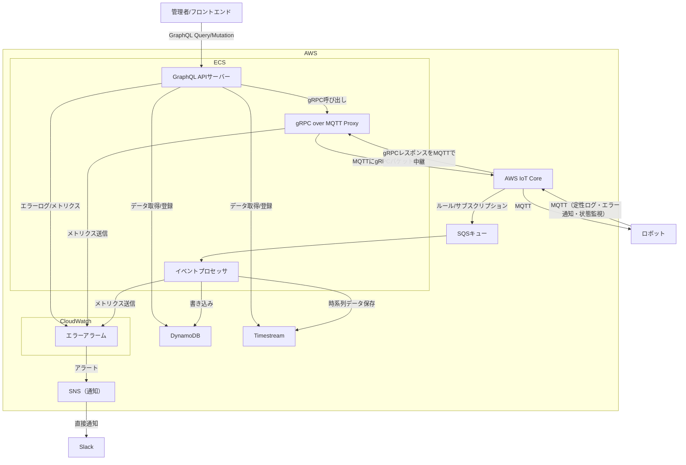

## 主な改善点

### 1. **GraphQL API サーバーの利点**

- **効率的なデータ取得**: 必要なデータのみを 1 回のリクエストで取得可能
- **型安全性**: GraphQL スキーマによる強力な型チェック
- **リアルタイム通信**: GraphQL Subscriptions で WebSocket 経由のリアルタイム更新
- **フロントエンド開発効率**: 柔軟なクエリ構造でフロントエンド開発が効率化

### 2. **gRPC over MQTT Proxy の利点**

- **高性能通信**: gRPC の効率的なシリアライゼーション（Protocol Buffers）
- **型安全性**: 強力な型定義とコード生成
- **双方向通信**: ストリーミング対応でリアルタイム制御が可能
- **既存 MQTT インフラ活用**: AWS IoT Core の既存インフラを活用

### 3. **アーキテクチャの利点**

- **スケーラビリティ**: GraphQL と gRPC の両方が水平スケーリングに適している
- **開発効率**: 型安全性とコード生成による開発効率向上
- **運用性**: 明確な責任分離とモニタリング

## 実装上の考慮点

### GraphQL サーバー

- **Apollo Server** または **GraphQL Yoga** の使用
- **Dataloader** による N+1 問題の解決
- **GraphQL Subscriptions** でリアルタイム更新

### gRPC over MQTT Proxy

- **Protocol Buffers** による効率的なシリアライゼーション
- **gRPC-Web** でブラウザからの直接アクセスも可能
- **MQTT トピック設計** で gRPC メッセージの適切なルーティング

このアーキテクチャにより、より効率的で型安全なロボット制御システムが実現できます。特に、フロントエンド開発の効率化とリアルタイム通信の強化が期待できます。
