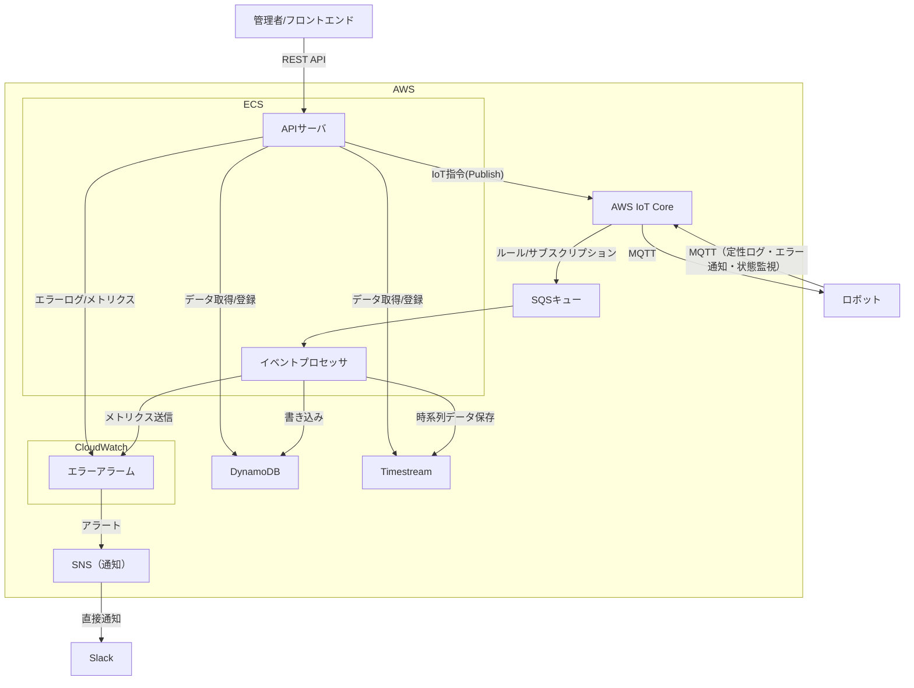

```mermaid
graph TD
    Admin[管理者/フロントエンド]
    Robot[ロボット]

    subgraph AWS
        DynamoDB[DynamoDB]
        Timestream[Timestream]
        IoTCore[AWS IoT Core]
        SQS[SQSキュー]
        SNS[SNS（通知）]
        subgraph ECS
            APIServer[APIサーバ]
            EventProcessor[イベントプロセッサ]
        end
        subgraph CloudWatch
            ErrorAlarm[エラーアラーム]
        end
    end

    Admin -->|REST API| APIServer
    APIServer -- データ取得/登録 --> DynamoDB
    APIServer -- データ取得/登録 --> Timestream
    APIServer -- IoT指令(Publish) --> IoTCore

    IoTCore -- MQTT --> Robot
    Robot -- MQTT（定性ログ・エラー通知・状態監視） --> IoTCore

    IoTCore -- ルール/サブスクリプション --> SQS
    SQS --> EventProcessor
    EventProcessor -- 書き込み --> DynamoDB
    EventProcessor -- 時系列データ保存 --> Timestream

    %% CloudWatch監視
    APIServer -- エラーログ/メトリクス --> ErrorAlarm
    EventProcessor -- メトリクス送信 --> ErrorAlarm
    ErrorAlarm -- アラート --> SNS
    SNS -- 直接通知 --> Slack[Slack]
```
