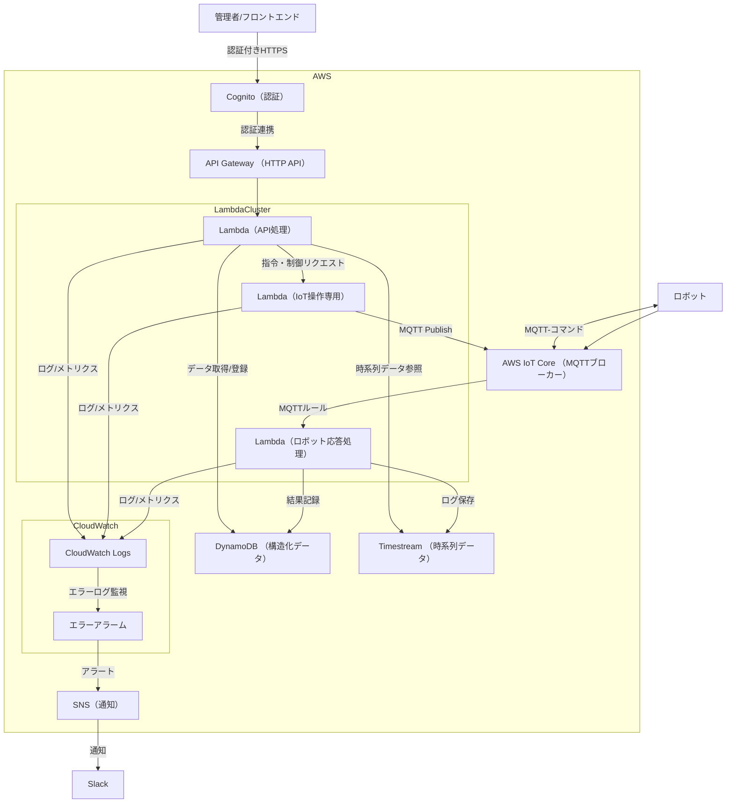

**[← 概要・全体構成に戻る](./index.md)**
# システム構成図・アーキテクチャ

## 概要

ロボット管理システムは、**AWS Lambda ベースのサーバーレスアーキテクチャ**と **AWS IoT Core による MQTT 通信**を中心とした効率的でスケーラブルなアーキテクチャを採用。

## アーキテクチャ図

## アーキテクチャの特徴

### 主要コンポーネント

- **API Gateway + Lambda**: 管理者向けの REST API 提供とスケーラブルな処理
- **AWS IoT Core**: MQTT メッセージングによる IoT デバイスとの双方向通信
- **Lambda（IoT 操作専用）**: ロボットへの指令送信と MQTT 通信制御
- **Lambda（ロボット応答処理）**: ロボットからの応答・データ処理
- **DynamoDB**: 指令・状態・エラー情報の永続化
- **Timestream**: 時系列データの効率的な保存・分析
- **Cognito**: 認証・認可機能
- **CloudWatch**: 監視・ログ集約・アラート

## 主な利点

### 1. **サーバーレスアーキテクチャ**

- **自動スケーリング**: Lambda 関数による需要に応じた自動スケーリング
- **コスト効率**: 実行時間のみの課金でコスト最適化
- **運用負荷軽減**: サーバー管理不要でインフラ運用が簡素化
- **高可用性**: AWS の分散インフラによる高い可用性

### 2. **MQTT 通信による IoT 連携**

- **軽量プロトコル**: 低帯域・低電力環境に適した MQTT 通信
- **双方向通信**: リアルタイムでの指令送信と状態受信
- **接続管理**: AWS IoT Core による安全で安定した接続管理
- **メッセージルーティング**: MQTT ルールによる柔軟なメッセージ処理

### 3. **データ管理**

- **構造化データ**: DynamoDB による高性能な NoSQL データベース
- **時系列データ**: Timestream による効率的な時系列データ保存・分析
- **データ分離**: 用途に応じたデータストアの使い分け

### 4. **監視・運用**

- **統合監視**: CloudWatch による包括的な監視とログ管理
- **アラート機能**: 異常検知時の自動通知（SNS → Slack）
- **トレーサビリティ**: 全処理フローのログ記録

## 実装上の考慮点

### Lambda 関数設計

- **単一責任**: API 処理、IoT 操作、応答処理の明確な役割分離
- **コールドスタート対策**: 関数の初期化時間最適化
- **エラーハンドリング**: 適切な例外処理とリトライ機構

### MQTT 通信設計

- **トピック設計**: 効率的なメッセージルーティングのためのトピック構造
- **メッセージフォーマット**: JSON 形式による標準化されたメッセージ構造
- **セキュリティ**: 証明書ベースの認証と TLS 暗号化

### データ設計

- **DynamoDB**: パーティションキー設計による効率的なデータアクセス
- **Timestream**: 時系列データの効率的な保存・クエリ設計
- **データ整合性**: 分散システムでの適切な整合性管理

