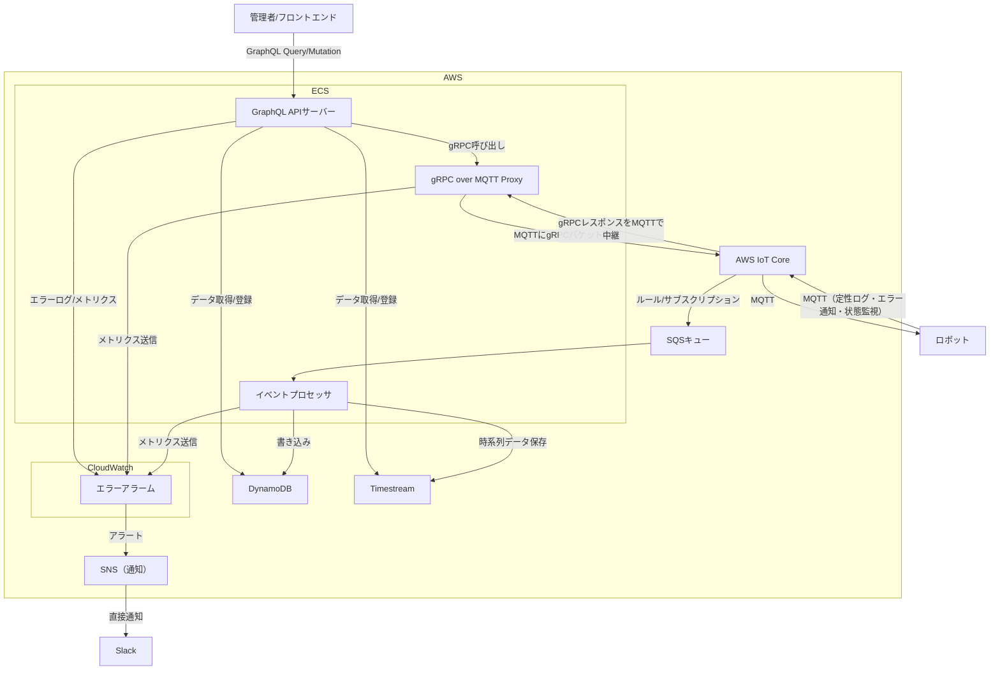

# システム構成図・アーキテクチャ

## 概要

ロボット管理システムは、**GraphQL API サーバー**と **gRPC over MQTT Proxy** を中心とした効率的でスケーラブルなアーキテクチャを採用。

## アーキテクチャ図

## アーキテクチャの特徴

### 主要コンポーネント

- **GraphQL API サーバー**: 管理者向けの効率的なデータ取得・操作
- **gRPC over MQTT Proxy**: ロボットとの高性能・型安全な通信
- **AWS IoT Core**: MQTT メッセージングによる IoT デバイス通信
- **DynamoDB**: 指令・状態・エラー情報の永続化
- **Timestream**: 時系列データの効率的な保存・分析

## 主な利点

### 1. **GraphQL API サーバー**

- **効率的なデータ取得**: 必要なデータのみを 1 回のリクエストで取得可能
- **型安全性**: GraphQL スキーマによる強力な型チェック
- **リアルタイム通信**: GraphQL Subscriptions で WebSocket 経由のリアルタイム更新
- **フロントエンド開発効率**: 柔軟なクエリ構造でフロントエンド開発が効率化

### 2. **gRPC over MQTT Proxy**

- **高性能通信**: gRPC の効率的なシリアライゼーション（Protocol Buffers）
- **型安全性**: 強力な型定義とコード生成
- **双方向通信**: ストリーミング対応でリアルタイム制御が可能
- **既存 MQTT インフラ活用**: AWS IoT Core の既存インフラを活用

### 3. **アーキテクチャ**

- **スケーラビリティ**: GraphQL と gRPC の両方が水平スケーリングに適している
- **開発効率**: 型安全性とコード生成による開発効率向上
- **運用性**: 明確な責任分離とモニタリング

## 実装上の考慮点

### GraphQL サーバー

- **Apollo Server** または **GraphQL Yoga** の使用
- **Dataloader** による N+1 問題の解決
- **GraphQL Subscriptions** でリアルタイム更新

### gRPC over MQTT Proxy

- **Protocol Buffers** による効率的なシリアライゼーション
- **MQTT トピック設計** で gRPC メッセージの適切なルーティング

