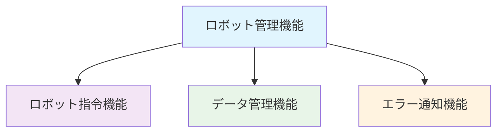

# ロボットクラウドシステム 機能要求仕様

## 機能概要

### 1. ロボット管理機能

システムの基盤機能として、ロボット個体の登録・管理・接続確認を行う。他の全ての機能の前提条件となる。

### 2. ロボット指令機能

管理者からロボットへの指令送信と、その実行状況の確認を行う。

### 3. データ管理機能

ロボットから送信される時系列データやイベントログの記録・閲覧、および実験セッションの管理を行う。

### 4. エラー通知機能

ロボットで発生したエラーの検知・記録・通知を行う。Slack への即時通知により迅速な対応を可能にする。

## 機能間の依存関係

**ロボット管理機能**が基盤機能として、他の全ての機能の前提条件となります。

## 各機能の詳細要求

### 1. ロボット管理機能 (UC1)

**目的**: システムの基盤機能として、ロボット個体の登録・管理・接続確認を行う

**機能要求**:

- ロボット個体の一意識別
- ロボット基本情報の管理
- ロボット接続状態の監視
- 他の機能への基盤情報提供

### 2. ロボット指令機能 (UC2)

**目的**: 管理者からロボットへの指令送信と、その実行状況の確認を行う

**機能要求**:

- 指令の送信・管理
- 実行状況の監視
- 指令履歴の記録
- エラーハンドリング

### 3. データ管理機能 (UC3)

**目的**: ロボットから送信される時系列データやイベントログの記録・閲覧、および実験セッションの管理を行う

**機能要求**:

- 時系列データの記録・管理
- イベントログの記録・管理
- 実験セッションの管理
- データの閲覧・分析機能

### 4. エラー通知機能 (UC4)

**目的**: ロボットで発生したエラーの検知・記録・通知を行う

**機能要求**:

- エラー検知・記録
- 即時通知機能
- エラー情報の管理
- 外部システム連携（Slack 等）

## 関連ドキュメント

- [ユースケース概要](../20_usecases/index.md)
- [システム設計](../30_architecture/system_architecture.md)
