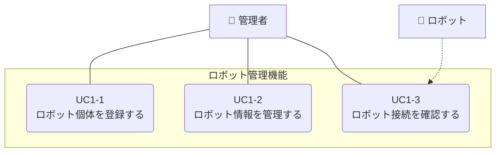

**[← ユースケースに戻る](../index.md)**

# ロボット管理機能

## 概要

管理者はシステムにロボット個体を登録し、登録されたロボットの基本情報を管理できる。このユースケースは、データ記録やエラー通知などの他のユースケースの前提条件となる基盤機能を提供する。

## ユースケース一覧

| UC ID | ユースケース名         | 説明                                             | 詳細            |
| ----- | ---------------------- | ------------------------------------------------ | --------------- |
| UC1-1 | ロボット個体を登録する | 管理者が新しいロボット個体をシステムに登録する   | [詳細](uc01_01.md) |
| UC1-2 | ロボット情報を管理する | 管理者がロボット個体の情報を閲覧・更新・削除する | [詳細](uc01_02.md) |
| UC1-3 | ロボット接続を確認する | 管理者がロボット個体との通信状態を確認する       | [詳細](uc01_03.md) |

## ユースケース図

## 基盤機能としての役割

このユースケースは、ロボットクラウドシステム全体の基盤となる機能を提供する：

1. **ロボット個体の一意識別**: 全システムでロボット ID による識別を可能にする
2. **メタデータの提供**: 各ロボットの基本情報を他の機能に提供する
3. **データ整合性の保証**: 登録されたロボットのみがシステムを利用可能
4. **管理の一元化**: ロボット情報の統一的な管理とメンテナンス

## 他のユースケースとの関連

このユースケースは、全システムの基盤となる機能を提供します。他のユースケースとの詳細な関連性については、以下のドキュメントを参照してください：

📖 **[ユースケース間の関連](../usecase_relationships.md)**

---
