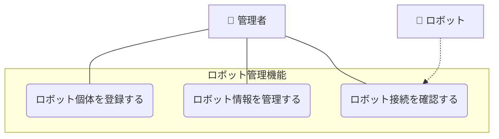

# ロボット管理機能

## ユースケース一覧

| UC ID | ユースケース名         | 説明                                             |
| ----- | ---------------------- | ------------------------------------------------ |
| UC1-1 | ロボット個体を登録する | 管理者が新しいロボット個体をシステムに登録する   |
| UC1-2 | ロボット情報を管理する | 管理者がロボット個体の情報を閲覧・更新・削除する |
| UC1-3 | ロボット接続を確認する | 管理者がロボット個体との通信状態を確認する       |

## ユースケース図

## ユースケース記述

### 概要

管理者はシステムにロボット個体を登録し、登録されたロボットの基本情報を管理できる。このユースケースは、データ記録やエラー通知などの他のユースケースの前提条件となる基盤機能を提供する。ロボット個体の登録により、システム内で各ロボットを一意に識別し、個体別のデータ管理が可能になる。

### アクター

- 管理者
- ロボット（UC1-3 接続確認時のみ）

### 事前条件

- 管理者が適切な権限を持っている
- システムが正常に動作している
- ロボット個体が物理的に存在している

### 事後条件

- ロボット個体がシステムに登録されている
- ロボット基本情報が正確に管理されている
- 他のユースケースでロボット個体が正確に識別される

### 基本フロー

#### UC1-1: ロボット個体を登録する

1. 管理者がロボット管理画面にアクセスする
2. 管理者が「新しいロボット登録」を選択する
3. 管理者がロボット個体の情報を入力する
4. システムはロボット ID の重複をチェックする
5. システムはロボット個体を登録し、登録完了を通知する
6. 管理者は登録されたロボット情報を確認する

#### UC1-2: ロボット情報を管理する

1. 管理者がロボット管理画面にアクセスする
2. 管理者が管理対象のロボット個体を選択する
3. 管理者が操作を選択する
   - **情報閲覧**: ロボット詳細情報を表示
   - **情報更新**: ロボット情報を編集・保存（ID 変更可能）
   - **登録削除**: ロボット登録を削除（確認ダイアログ付き）
4. システムは選択された操作を実行する
5. システムは操作結果を管理者に通知する

#### UC1-3: ロボット接続を確認する

1. 管理者がロボット管理画面にアクセスする
2. 管理者が接続確認対象のロボット個体を選択する
3. 管理者が「接続テスト」を実行する
4. システムは選択されたロボットに通信要求を送信する
5. ロボットはシステムからの通信要求に応答する
6. システムは接続テスト結果を表示する
   - **接続成功**: 通信状態、応答時間、ロボット状態を表示
   - **接続失敗**: エラー原因、エラーメッセージを表示
7. システムは接続テスト実行をイベントログとして記録する（成功・失敗の結果のみ）
8. 接続失敗の場合、システムは詳細なエラー情報をエラーログに記録する（関連イベント ID 付き）
9. 管理者は接続テスト結果を確認する

### 例外フロー

#### ロボット登録エラー時

- ロボット ID が重複している場合、エラーメッセージを表示し、別の ID の入力を促す
- 必須情報が不足している場合、入力エラーを表示する
- システムエラーが発生した場合、エラーメッセージを表示し、再試行を促す

#### 情報管理エラー時

- 存在しないロボット ID を指定した場合、エラーメッセージを表示する
- ロボット ID を他の登録済みロボットと重複する値に変更しようとした場合、エラーメッセージを表示する

- 他のプロセスで使用中のロボットを削除しようとした場合、警告メッセージを表示する
- 更新権限がない場合、アクセス拒否メッセージを表示する

#### 接続確認エラー時

- ロボットとの通信に失敗した場合、エラー原因を特定して表示する
- ネットワーク接続の問題の場合、「ネットワークエラー」として表示する
- ロボットが応答しない場合、「ロボット応答なし」として表示する
- 認証エラーの場合、「認証失敗」として表示する

## 他のユースケースとの関連

このユースケースは、全システムの基盤となる機能を提供します。他のユースケースとの詳細な関連性については、以下のドキュメントを参照してください：

📖 **[ユースケース間の関連](../usecase_relationships.md)**

## 基盤機能としての役割

このユースケースは、ロボットクラウドシステム全体の基盤となる機能を提供する：

1. **ロボット個体の一意識別**: 全システムでロボット ID による識別を可能にする
2. **メタデータの提供**: 各ロボットの基本情報を他の機能に提供する
3. **データ整合性の保証**: 登録されたロボットのみがシステムを利用可能
4. **管理の一元化**: ロボット情報の統一的な管理とメンテナンス

## 関連ファイル

- [シーケンス図](sequence.mmd)
- [API 仕様](api_spec.md)
- [クラス図](class_diagram.pu)
