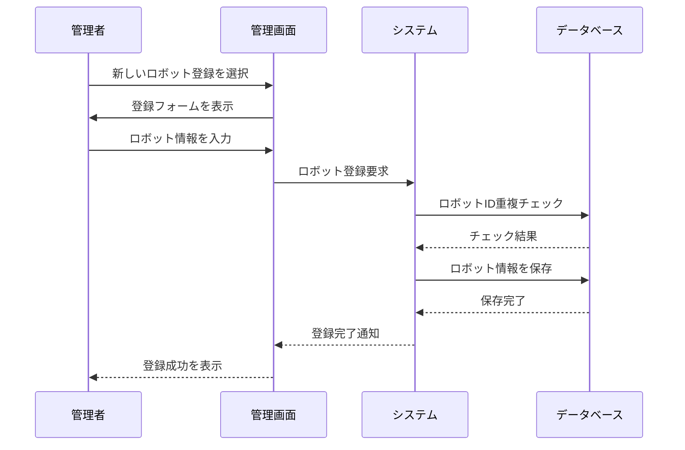
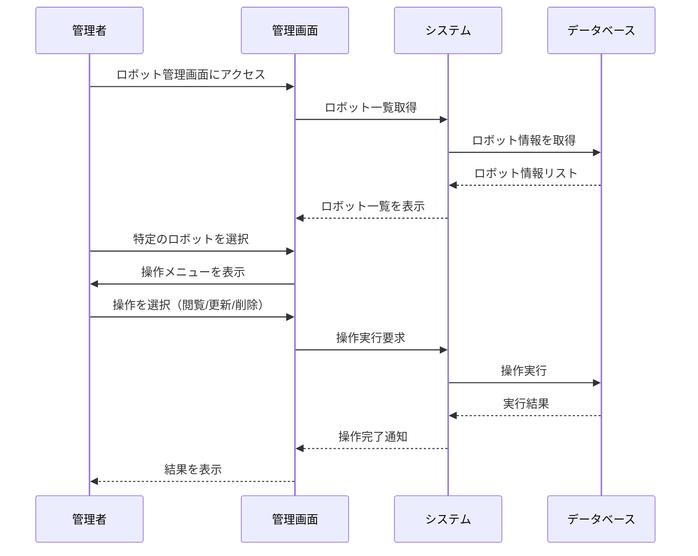
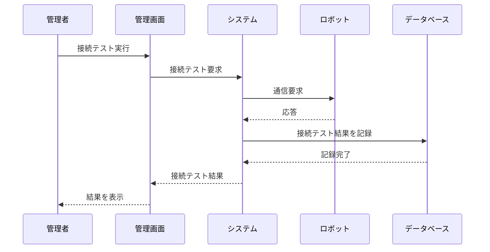

# ロボット管理機能 - シーケンス図

## UC1-1: ロボット個体を登録する

```mermaid
sequenceDiagram
    participant Admin as 管理者
    participant UI as 管理画面
    participant System as システム
    participant DB as データベース

    Admin->>UI: 新しいロボット登録を選択
    UI->>Admin: 登録フォームを表示
    Admin->>UI: ロボット情報を入力
    UI->>System: ロボット登録要求
    System->>DB: ロボットID重複チェック
    DB-->>System: チェック結果
    System->>DB: ロボット情報を保存
    DB-->>System: 保存完了
    System-->>UI: 登録完了通知
    UI-->>Admin: 登録成功を表示
```

## UC1-2: ロボット情報を管理する

```mermaid
sequenceDiagram
    participant Admin as 管理者
    participant UI as 管理画面
    participant System as システム
    participant DB as データベース

    Admin->>UI: ロボット管理画面にアクセス
    UI->>System: ロボット一覧取得
    System->>DB: ロボット情報を取得
    DB-->>System: ロボット情報リスト
    System-->>UI: ロボット一覧を表示
    Admin->>UI: 特定のロボットを選択
    UI->>Admin: 操作メニューを表示
    Admin->>UI: 操作を選択（閲覧/更新/削除）
    UI->>System: 操作実行要求
    System->>DB: 操作実行
    DB-->>System: 実行結果
    System-->>UI: 操作完了通知
    UI-->>Admin: 結果を表示
```

## UC1-3: ロボット接続を確認する

```mermaid
sequenceDiagram
    participant Admin as 管理者
    participant UI as 管理画面
    participant System as システム
    participant Robot as ロボット
    participant DB as データベース

    Admin->>UI: 接続テスト実行
    UI->>System: 接続テスト要求
    System->>Robot: 通信要求
    Robot-->>System: 応答
    System->>DB: 接続テスト結果を記録
    DB-->>System: 記録完了
    System-->>UI: 接続テスト結果
    UI-->>Admin: 結果を表示
```
