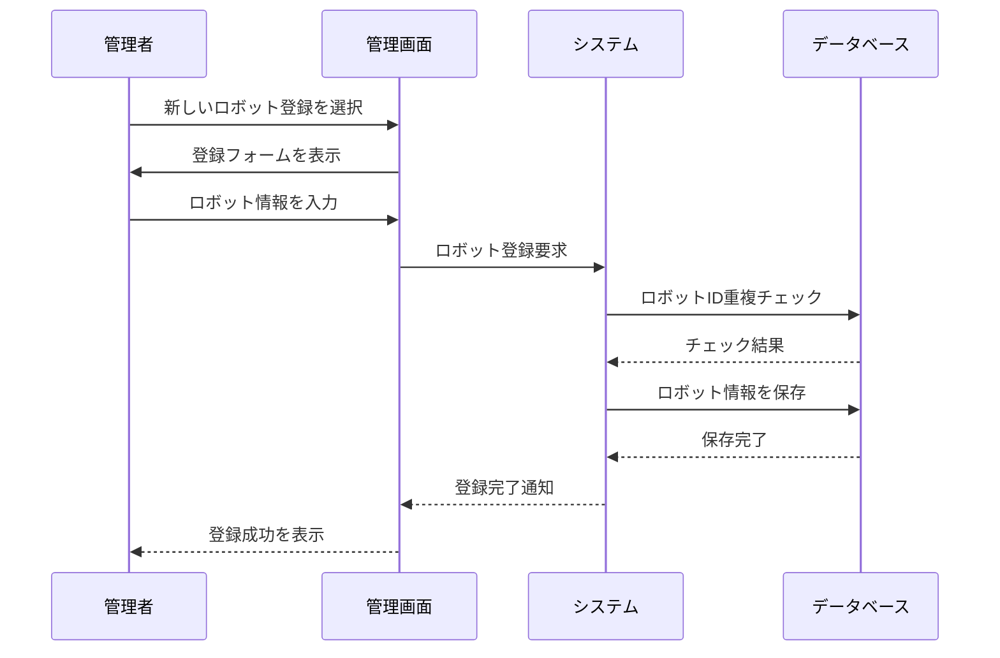

**[← 戻る](index.md)**

# UC1-1: ロボット個体を登録する

## 概要

管理者が新しいロボット個体をシステムに登録する。

## アクター

- 管理者

## 事前条件

- 管理者が適切な権限を持っている
- システムが正常に動作している
- ロボット個体が物理的に存在している

## 事後条件

- ロボット個体がシステムに登録されている
- ロボット基本情報が正確に保存されている
- 他のユースケースでロボット個体が正確に識別される

## 基本フロー

1. 管理者がロボット管理画面にアクセスする
2. 管理者が「新しいロボット登録」を選択する
3. 管理者がロボット個体の情報を入力する
4. システムはロボット ID の重複をチェックする
5. システムはロボット個体を登録し、登録完了を通知する
6. 管理者は登録されたロボット情報を確認する

## シーケンス図

---
