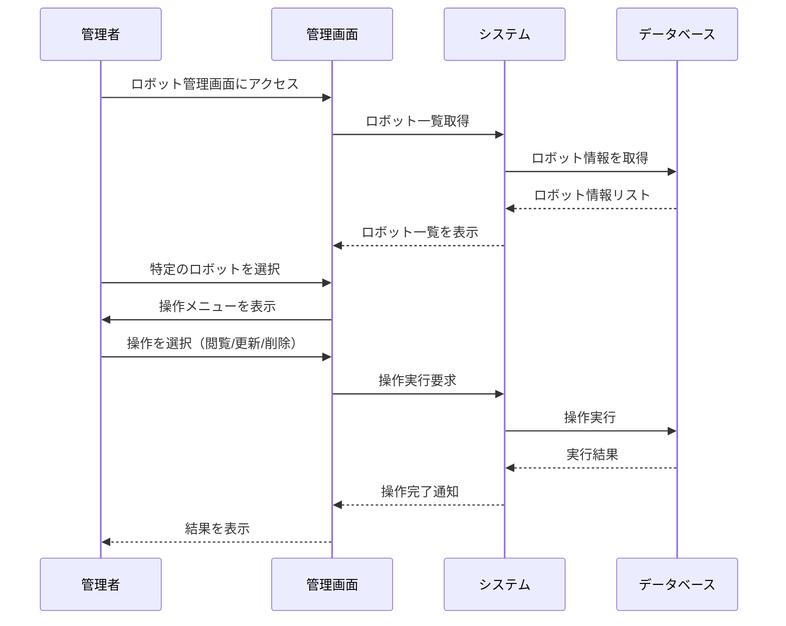

**[← 戻る](index.md)**

# UC1-2: ロボット情報を管理する

## 概要

管理者がロボット個体の情報を閲覧・更新・削除する。

## アクター

- 管理者

## 事前条件

- 管理者が適切な権限を持っている
- システムが正常に動作している
- ロボット個体がシステムに登録されている

## 事後条件

- ロボット情報が正確に管理されている
- 実行された操作の結果が保存されている

## 基本フロー

1. 管理者がロボット管理画面にアクセスする
2. 管理者が管理対象のロボット個体を選択する
3. 管理者が操作を選択する
   - **情報閲覧**: ロボット詳細情報を表示
   - **情報更新**: ロボット情報を編集・保存（ID 変更可能）
   - **登録削除**: ロボット登録を削除（確認ダイアログ付き）
4. システムは選択された操作を実行する
5. システムは操作結果を管理者に通知する

## シーケンス図

---

