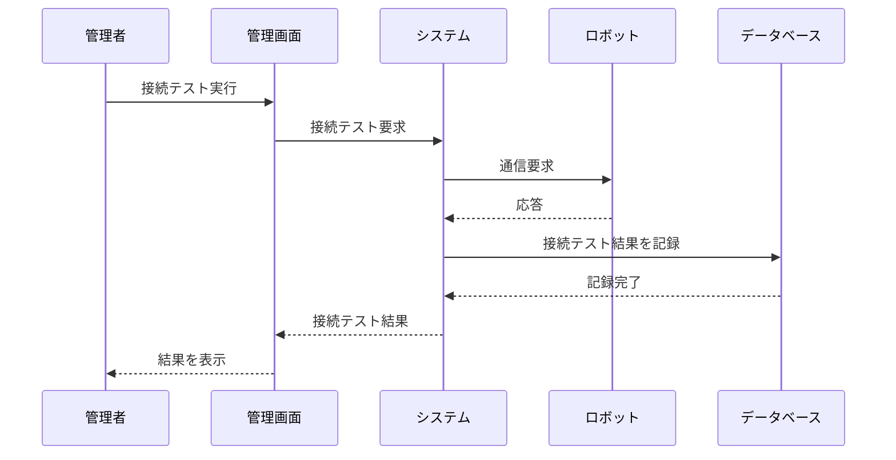

**[← 戻る](index.md)**

# UC1-3: ロボット接続を確認する

## 概要

管理者がロボット個体との通信状態を確認する。

## アクター

- 管理者
- ロボット

## 事前条件

- 管理者が適切な権限を持っている
- システムが正常に動作している
- ロボット個体がシステムに登録されている
- ロボット個体が通信可能な状態にある

## 事後条件

- 接続テスト結果が記録されている
- 管理者が接続状態を確認できている

## 基本フロー

1. 管理者がロボット管理画面にアクセスする
2. 管理者が接続確認対象のロボット個体を選択する
3. 管理者が「接続テスト」を実行する
4. システムは選択されたロボットに通信要求を送信する
5. ロボットはシステムからの通信要求に応答する
6. システムは接続テスト結果を表示する
   - **接続成功**: 通信状態、応答時間、ロボット状態を表示
   - **接続失敗**: エラー原因、エラーメッセージを表示
7. システムは接続テスト実行をイベントログとして記録する（成功・失敗の結果のみ）
8. 接続失敗の場合、システムは詳細なエラー情報をエラーログに記録する（関連イベント ID 付き）
9. 管理者は接続テスト結果を確認する

## シーケンス図

---

