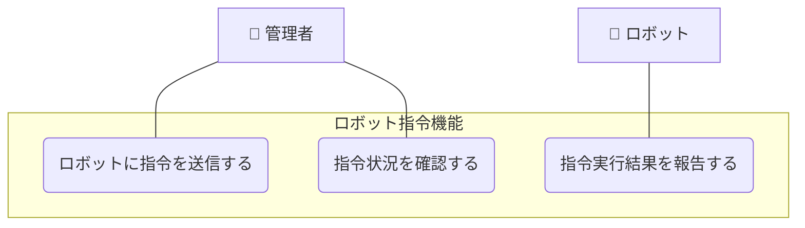

# ロボット指令機能

## ユースケース一覧

| UC ID | ユースケース名           | 説明                                         |
| ----- | ------------------------ | -------------------------------------------- |
| UC2-1 | ロボットに指令を送信する | 管理者がロボットに行動指令を送信する         |
| UC2-2 | 指令実行結果を報告する   | ロボットが指令の実行結果をシステムに報告する |
| UC2-3 | 指令状況を確認する       | 管理者が指令の実行状況を管理画面で確認する   |

## ユースケース図

## ユースケース記述

### 概要

管理者は管理画面からロボットに対して行動指令（例：充電、巡回、停止など）を送信できる。ロボットは指令を受信して実行し、その結果をシステムに報告する。管理者は指令の実行状況を管理画面で確認できる。

### アクター

- 管理者
- ロボット

### 事前条件

- ロボットがシステムに登録されている（UC1-1 の完了）
- 管理者が適切な権限を持っている
- システムが正常に動作している
- ロボットがオンライン状態である

### 事後条件

- 指令が正常に送信されている
- 指令の実行結果が記録されている
- 管理者が指令状況を確認できる

### 基本フロー

#### UC2-1: ロボットに指令を送信する

1. 管理者が管理画面にアクセスする
2. 管理者がロボットを選択する
3. 管理者が行動指令（充電、巡回、停止など）を選択する
4. 管理者が指令を送信する
5. システムは指令をロボットに送信する
6. システムは指令送信完了を管理者に通知する

#### UC2-2: 指令実行結果を報告する

1. ロボットが指令を受信する
2. ロボットが指令の実行を開始する
3. ロボットが指令の実行状況をシステムに報告する
4. ロボットが指令の完了をシステムに報告する
5. システムは実行結果を記録する

#### UC2-3: 指令状況を確認する

1. 管理者が管理画面にアクセスする
2. 管理者が指令状況確認画面を開く
3. システムは指令の進捗状況を表示する
4. 管理者は指令の実行状況を確認する
5. 管理者は必要に応じて指令の中断や再送信を行う

### 例外フロー

#### 指令送信エラー時

- ロボットとの通信に失敗した場合、エラーメッセージを表示し、再送信を促す
- 存在しないロボットを指定した場合、エラーメッセージを表示する
- 無効な指令を送信しようとした場合、エラーメッセージを表示する

#### 指令実行エラー時

- ロボットが指令を実行できない場合、エラー詳細をシステムに報告する
- システムはエラー情報を記録し、管理者に通知する
- 管理者は指令の再送信や別の指令への変更を行う

#### 指令状況確認エラー時

- 指令状況の取得に失敗した場合、エラーメッセージを表示する
- 指令の中断に失敗した場合、エラーメッセージを表示し、再試行を促す

## 他のユースケースとの関連

このユースケースは、ロボット管理機能を基盤とし、データ管理機能やエラー通知機能と連携します。詳細な関連性については、以下のドキュメントを参照してください：

📖 **[ユースケース間の関連](../usecase_relationships.md)**

## 関連ファイル

- [シーケンス図](sequence.mmd)
- [API 仕様](api_spec.md)
- [クラス図](class_diagram.pu)
