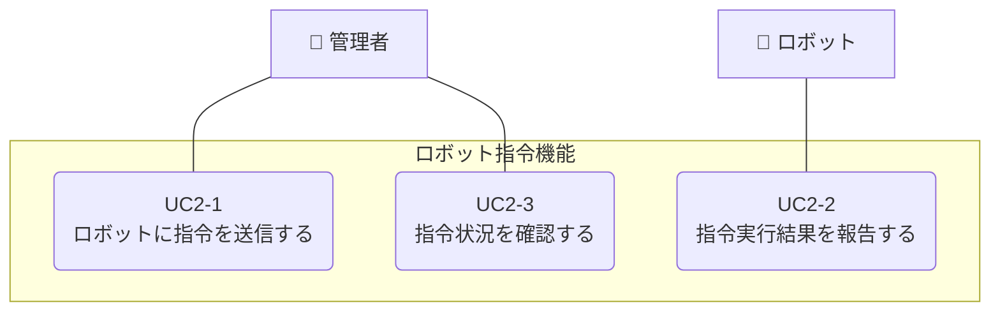

**[← ユースケースに戻る](../index.md)**

# ロボット指令機能

## 概要

管理者は管理画面からロボットに対して行動指令（例：充電、巡回、停止など）を送信できる。ロボットは指令を受信して実行し、その結果をシステムに報告する。管理者は指令の実行状況を管理画面で確認できる。

## ユースケース一覧

| UC ID | ユースケース名           | 説明                                         | 詳細               |
| ----- | ------------------------ | -------------------------------------------- | ------------------ |
| UC2-1 | ロボットに指令を送信する | 管理者がロボットに行動指令を送信する         | [詳細](uc02_01.md) |
| UC2-2 | 指令実行結果を報告する   | ロボットが指令の実行結果をシステムに報告する | [詳細](uc02_02.md) |
| UC2-3 | 指令状況を確認する       | 管理者が指令の実行状況を管理画面で確認する   | [詳細](uc02_03.md) |

## ユースケース図

## 他のユースケースとの関連

このユースケースは、ロボット管理機能を基盤とし、データ管理機能やエラー通知機能と連携します。詳細な関連性については、以下のドキュメントを参照してください：

📖 **[ユースケース間の関連](../usecase_relationships.md)**
