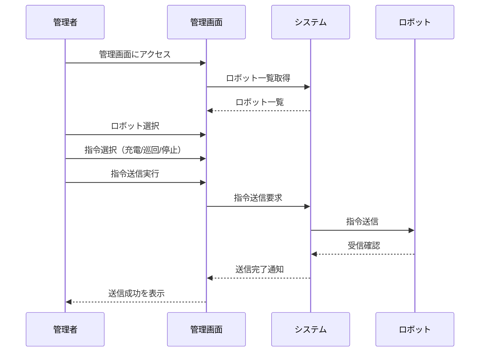
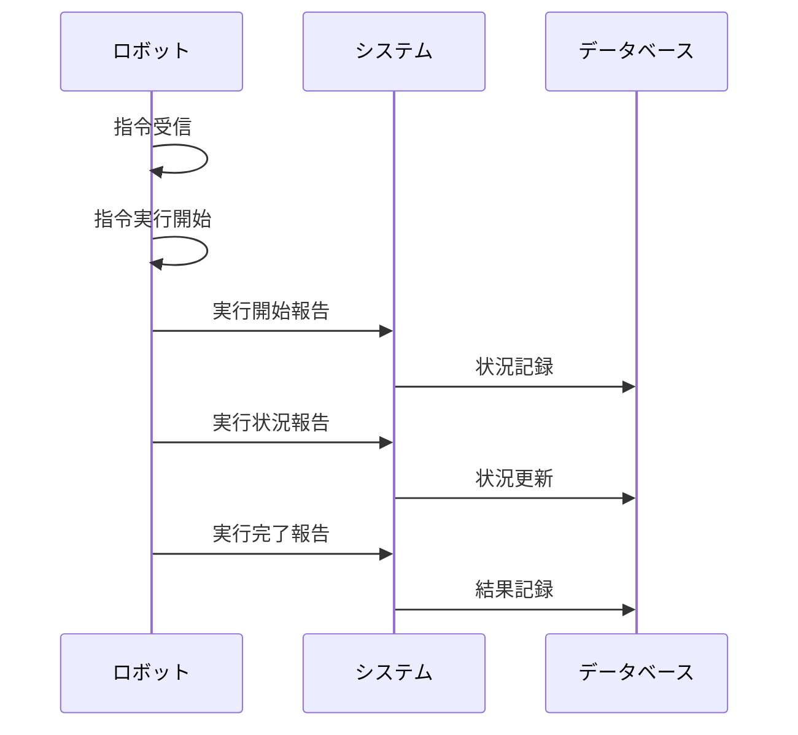
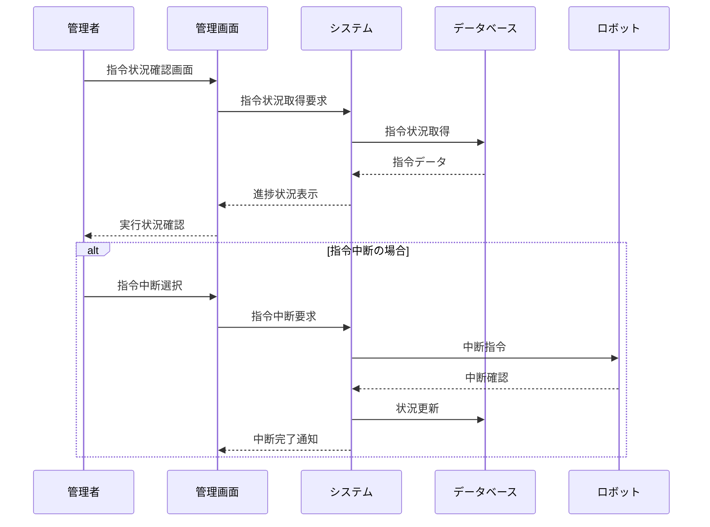

# ロボット指令機能 - シーケンス図

## UC2-1: ロボットに指令を送信する

```mermaid
sequenceDiagram
    participant Admin as 管理者
    participant UI as 管理画面
    participant System as システム
    participant Robot as ロボット

    Admin->>UI: 管理画面にアクセス
    UI->>System: ロボット一覧取得
    System-->>UI: ロボット一覧
    Admin->>UI: ロボット選択
    Admin->>UI: 指令選択（充電/巡回/停止）
    Admin->>UI: 指令送信実行
    UI->>System: 指令送信要求
    System->>Robot: 指令送信
    Robot-->>System: 受信確認
    System-->>UI: 送信完了通知
    UI-->>Admin: 送信成功を表示
```

## UC2-2: 指令実行結果を報告する

```mermaid
sequenceDiagram
    participant Robot as ロボット
    participant System as システム
    participant DB as データベース

    Robot->>Robot: 指令受信
    Robot->>Robot: 指令実行開始
    Robot->>System: 実行開始報告
    System->>DB: 状況記録
    Robot->>System: 実行状況報告
    System->>DB: 状況更新
    Robot->>System: 実行完了報告
    System->>DB: 結果記録
```

## UC2-3: 指令状況を確認する

```mermaid
sequenceDiagram
    participant Admin as 管理者
    participant UI as 管理画面
    participant System as システム
    participant DB as データベース
    participant Robot as ロボット

    Admin->>UI: 指令状況確認画面
    UI->>System: 指令状況取得要求
    System->>DB: 指令状況取得
    DB-->>System: 指令データ
    System-->>UI: 進捗状況表示
    UI-->>Admin: 実行状況確認
    
    alt 指令中断の場合
        Admin->>UI: 指令中断選択
        UI->>System: 指令中断要求
        System->>Robot: 中断指令
        Robot-->>System: 中断確認
        System->>DB: 状況更新
        System-->>UI: 中断完了通知
    end
``` 