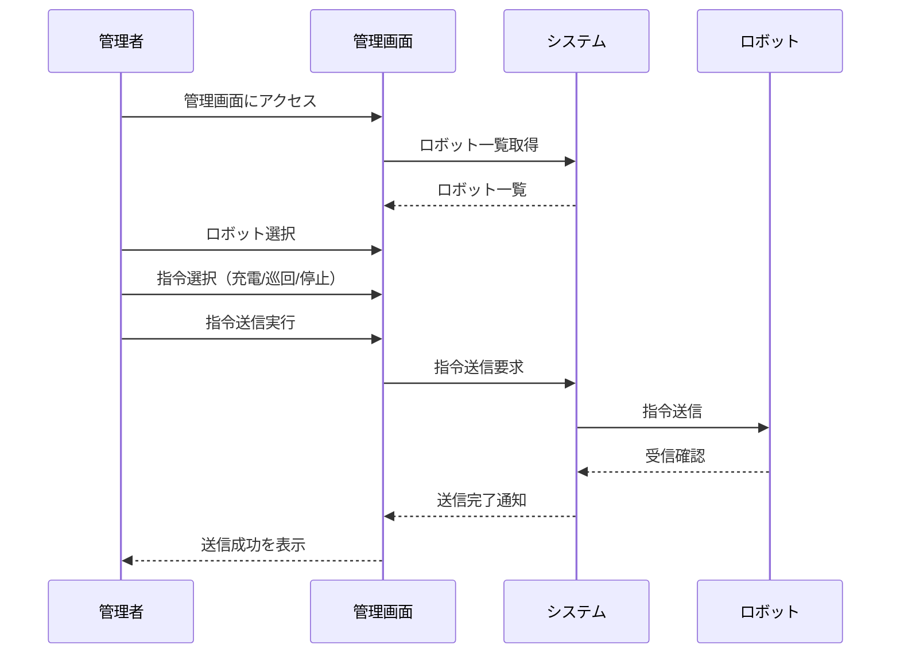

**[← 戻る](index.md)**

# UC2-1: ロボットに指令を送信する

## 概要

管理者は管理画面からロボットに対して行動指令（例：充電、巡回、停止など）を送信できる。システムは指令をロボットに転送し、送信完了を管理者に通知する。

## アクター

- 管理者

## 事前条件

- ロボットがシステムに登録されている（UC1-1 の完了）
- 管理者が適切な権限を持っている
- システムが正常に動作している
- ロボットがオンライン状態である

## 事後条件

- 指令が正常にロボットへ送信されている
- 指令送信の記録が残る
- 管理者に送信完了が通知される

## 基本フロー

1. 管理者が管理画面にアクセスする
2. 管理者が指令を送信したいロボットを選択する
3. 管理者が行動指令（例：充電、巡回、停止など）を選択する
4. 管理者が指令を送信する
5. システムは指令内容をロボットに送信する
6. システムは指令送信完了を管理者に通知する
7. システムは指令送信の履歴を記録する

## シーケンス図

