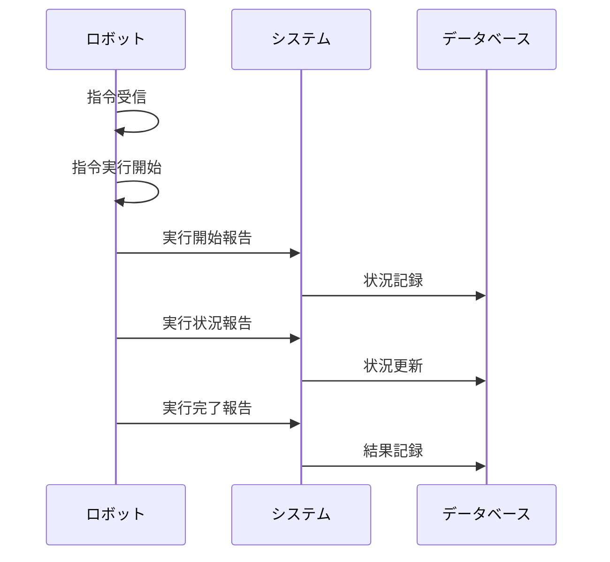

**[← 戻る](index.md)**

# UC2-2: 指令実行結果を報告する

## 概要

ロボットは受信した指令を実行し、その進捗や完了結果をシステムに報告する。システムは報告内容を記録し、管理者が後から確認できるようにする。

## アクター

- ロボット

## 事前条件

- ロボットがシステムに登録されている（UC1-1 の完了）
- ロボットがオンライン状態である
- 指令がロボットに正常に送信されている

## 事後条件

- 指令の実行結果がシステムに記録される
- 管理者が指令の実行状況・結果を確認できる

## 基本フロー

1. ロボットがシステムから指令を受信する
2. ロボットが指令の実行を開始する
3. ロボットが指令の実行状況（進捗・中間結果など）をシステムに報告する
4. ロボットが指令の完了（成功または失敗）をシステムに報告する
5. システムは報告された実行結果を記録する

## シーケンス図

## 例外フロー

- ロボットが指令実行中にエラーを検知した場合、エラー内容をシステムに報告する（UC4-1 と連携）
- 通信障害等で報告ができない場合、ロボットは再送信を試みる
- システムが報告を受信できなかった場合、管理者に通知する

## 関連ユースケース

- [UC2-1: ロボットに指令を送信する](uc02_01.md)
- [UC2-3: 指令状況を確認する](uc02_03.md)
- [UC4-1: エラーを検知・通知する](../UC04_error_notification/uc04_01.md)

## 備考

- 実行結果の記録はデータ管理機能（UC3-1）と連携する
- エラー発生時はエラー通知機能（UC4 系）と連携する
