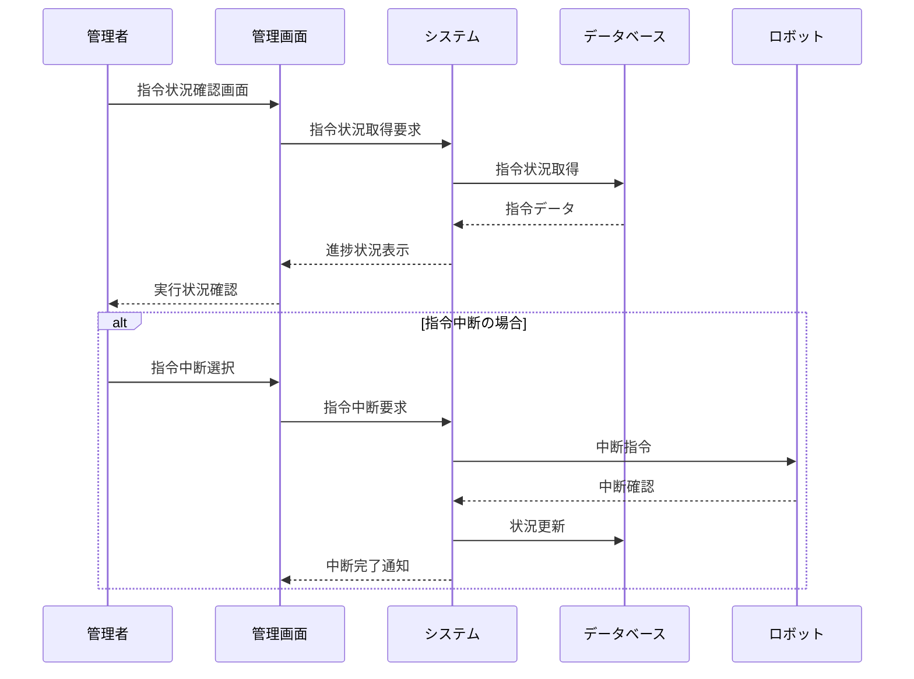

**[← 戻る](index.md)**

# UC2-3: 指令状況を確認する

## 概要

管理者が指令の実行状況を管理画面で確認する。

## アクター

- 管理者

## 事前条件

- ロボットがシステムに登録されている（UC1-1 の完了）
- 管理者が適切な権限を持っている
- システムが正常に動作している
- 指令が送信されている（UC2-1 の完了）

## 事後条件

- 管理者が指令状況を確認できている
- 必要に応じて指令の中断が実行されている

## 基本フロー

1. 管理者が指令状況確認画面にアクセスする
2. システムは現在の指令状況を取得する
3. システムは指令の進捗状況を表示する
   - 指令の種類と内容
   - 実行開始時刻
   - 現在の実行状況
   - 完了予定時刻
4. 管理者は指令状況を確認する
5. 必要に応じて管理者は指令を中断できる
   - 中断指令をロボットに送信
   - ロボットからの中断確認を受信
   - 指令状況を更新

## シーケンス図

---
