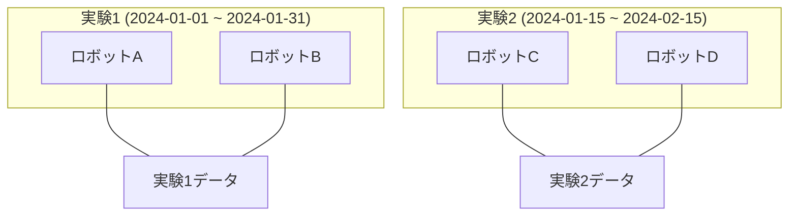
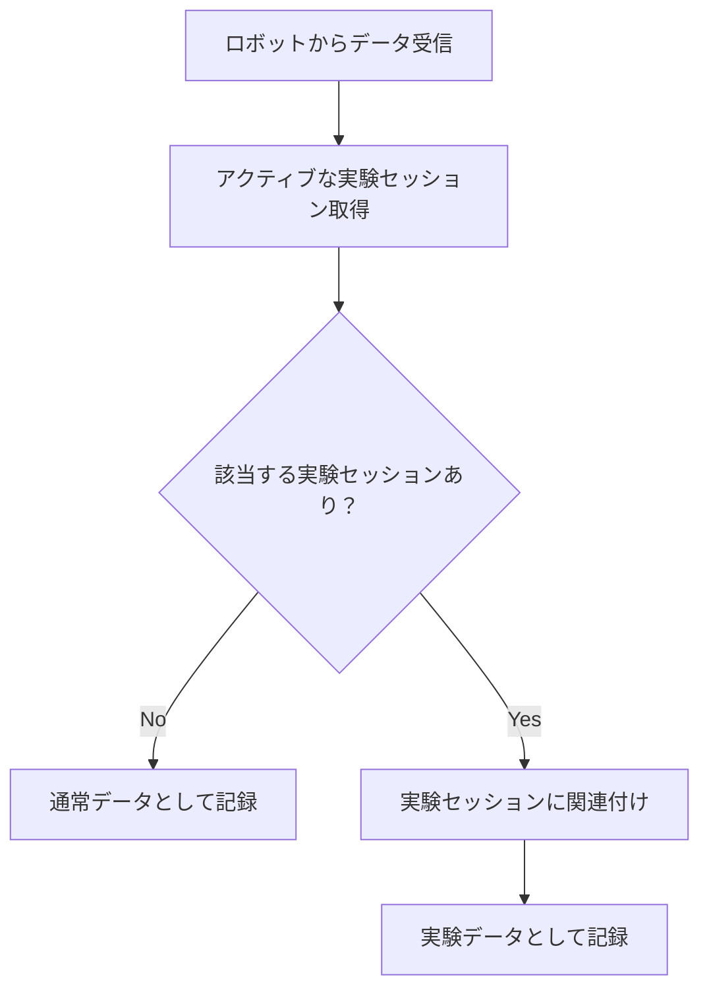

**[← 戻る](index.md)**

# 実験セッションの概念

## 実験セッションとは

**実験セッション**は、特定の実験や研究目的でロボットから収集されるデータを論理的にグループ化するための仕組みです。

- **目的**: 実験データの体系的な管理と分析
- **対象**: 特定の期間・特定のロボット群から収集されるデータ
- **管理**: システム側で一元管理され、ロボット側での設定変更は不要

## 複数実験の同時実行

本システムでは、**異なるロボットで異なる実験**を同時実行することをサポートしています。

### 採用パターン: 異なるロボットで異なる実験

**結果**: 各ロボットのデータは該当する実験にのみ関連付けられます。

### 将来的な懸念（現在は未サポート）

以下のパターンは現在サポートしていませんが、将来的に検討が必要な場合があります：

- **同じロボットで複数の実験（重複実行）**: 同じロボットが複数の実験期間にまたがって参加する場合
- **同じロボットで複数実験への重複参加**: 同じロボットが同時に複数の実験に参加する場合

これらのパターンが必要になった場合は、重複検知・解決機能の実装が必要になります。

## 実験セッションの自動関連付け

ロボットの環境変数に実験 ID を設定する必要はありません。システムが以下の方式で自動的に関連付けます：

1. **時間ベース判定**: データ受信時刻が実験期間内かチェック
2. **ロボット対象判定**: データ送信ロボットが実験対象かチェック
3. **自動 session_id 付与**: 条件に合致する場合、自動的に session_id を付与

## 利点

- **運用簡素化**: ロボット側での設定変更が不要
- **一元管理**: 実験セッションの集中管理が可能
- **エラー回避**: 環境変数設定ミスによるデータ紛失を防止
- **柔軟性**: 実験期間の変更や追加が容易
- **明確な分離**: 異なる実験のデータが混在しない

## 関連ドキュメント

- [データ管理機能](index.md)
- [API 仕様](api_spec.md)
- [シーケンス図](sequence.mmd)
