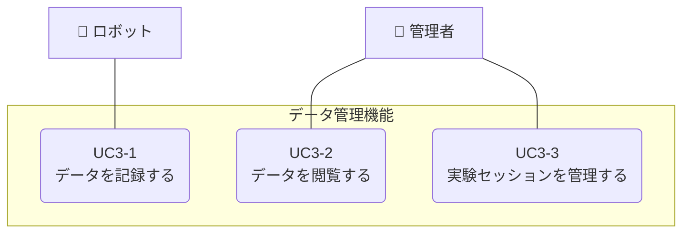

**[← ユースケースに戻る](../index.md)**

# データ管理機能

## 概要

ロボットは時系列データ（センサー値、位置情報など）やイベントログ（充電開始・終了、タスク実行など）をシステムに記録する。管理者は管理画面からこれらのデータを閲覧・分析できる。また、実験セッションを設定することで、特定の実験に関連するデータを区別して管理できる。

**複数実験の同時実行**: システムは異なるロボットで異なる実験を同時に実行することをサポートしています。これにより、複数の研究目的での並行実験が可能になります。

## ユースケース一覧

| UC ID | ユースケース名           | 説明                                                     | 詳細               |
| ----- | ------------------------ | -------------------------------------------------------- | ------------------ |
| UC3-1 | データを記録する         | ロボットが時系列データやイベントログをシステムに記録する | [詳細](uc03_01.md) |
| UC3-2 | データを閲覧する         | 管理者がデータを管理画面で閲覧・分析する                 | [詳細](uc03_02.md) |
| UC3-3 | 実験セッションを管理する | 管理者が実験セッションを作成・管理する                   | [詳細](uc03_03.md) |

## 実験セッション

実験セッションの詳細な概念、複数実験の同時実行、自動関連付け機能については、以下のドキュメントを参照してください：

📖 **[実験セッションの概念](experiment_session.md)**

## ユースケース図

## 他のユースケースとの関連

このユースケースは、システム全体のデータを統合的に管理する機能を提供します。詳細な関連性については、以下のドキュメントを参照してください：

📖 **[ユースケース間の関連](../usecase_relationships.md)**
