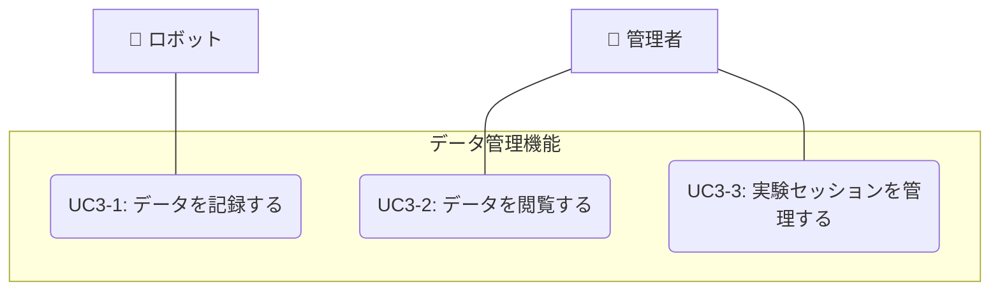

# データ管理機能

## ユースケース一覧

| UC ID | ユースケース名           | 説明                                                     |
| ----- | ------------------------ | -------------------------------------------------------- |
| UC3-1 | データを記録する         | ロボットが時系列データやイベントログをシステムに記録する |
| UC3-2 | データを閲覧する         | 管理者がデータを管理画面で閲覧・分析する                 |
| UC3-3 | 実験セッションを管理する | 管理者が実験セッションを作成・管理する                   |

## 実験セッション

実験セッションの詳細な概念、複数実験の同時実行、自動関連付け機能については、以下のドキュメントを参照してください：

📖 **[実験セッションの概念](experiment_session.md)**

## ユースケース図

## ユースケース記述

### 概要

ロボットは時系列データ（センサー値、位置情報など）やイベントログ（充電開始・終了、タスク実行など）をシステムに記録する。管理者は管理画面からこれらのデータを閲覧・分析できる。また、実験セッションを設定することで、特定の実験に関連するデータを区別して管理できる。

**複数実験の同時実行**: システムは異なるロボットで異なる実験を同時に実行することをサポートしています。これにより、複数の研究目的での並行実験が可能になります。各実験のデータは明確に分離され、混在することはありません。

### アクター

- ロボット
- 管理者

### 事前条件

- ロボットがシステムに登録されている（UC1-1 の完了）
- 管理者が適切な権限を持っている
- システムが正常に動作している
- データベースが正常に動作している

### 事後条件

- データが正常に記録されている
- 実験セッションが適切に管理されている
- 管理者が必要なデータにアクセスできる

### 基本フロー

#### UC3-1: データを記録する

1. ロボットがデータ（時系列データまたはイベントログ）をシステムに送信する
2. システムは現在の実験セッション設定を確認する
3. システムが以下の条件をチェックする：
   - データ受信時刻が実験期間内か
   - データ送信ロボットが実験対象か
4. 条件に合致する場合：
   - データに実験 ID とセッション情報を付与して記録する
5. 条件に合致しない場合：
   - データを通常データとして記録する
6. システムはデータの記録完了を確認する

#### UC3-2: データを閲覧する

1. 管理者が管理画面にアクセスする
2. 管理者がデータの閲覧条件を設定する
   - データ種別（時系列データ/イベントログ）
   - 期間指定
   - 実験セッション指定（全体/特定実験）
   - ロボット個体指定
3. システムは指定された条件に基づいてデータを取得する
4. システムはデータを表示する（グラフ、テーブル、ダッシュボード形式）

#### UC3-3: 実験セッションを管理する

1. 管理者が実験セッション管理画面にアクセスする
2. 管理者が実験セッションを作成する
   - 実験名、開始日時、終了日時、説明を設定
   - 対象ロボット個体を指定
   - 実験パラメータを設定
3. システムは実験セッションを作成・保存する
4. システムは既存セッションとの重複（同じロボットが複数実験に参加）をチェックする
5. 重複が検知された場合、エラーメッセージを表示し、作成を拒否する
6. 実験期間中、対象ロボットからのデータは自動的に実験 ID と紐付けられる
7. 管理者は実験セッションの状態を管理できる（開始/終了/削除）

### 例外フロー

#### データ記録エラー時

- データ送信に失敗した場合、システムはエラーログを記録し、ロボットに再送信を促す
- データ形式が不正な場合、システムはエラーメッセージを返す
- 実験セッション情報の取得に失敗した場合、通常データとして記録する
- 重複解決処理に失敗した場合、デフォルトルール（優先度ルール）を適用する

#### データ閲覧エラー時

- データが取得できない場合、エラーメッセージを表示する
- 権限がない実験データにアクセスした場合、アクセス拒否メッセージを表示する
- 指定された条件でデータが見つからない場合、「データが見つかりません」メッセージを表示する
- 複製データが存在する場合、重複データを統合して表示するか選択肢を提供する

#### 実験セッション管理エラー時

- 実験セッションの作成に失敗した場合、エラーメッセージを表示する
- 実行中の実験セッションを削除しようとした場合、警告メッセージを表示する
- 同じロボットが複数の実験に参加しようとした場合、重複エラーメッセージを表示し、作成を拒否する

## 他のユースケースとの関連

このユースケースは、システム全体のデータを統合的に管理する機能を提供します。詳細な関連性については、以下のドキュメントを参照してください：

📖 **[ユースケース間の関連](../usecase_relationships.md)**

## 関連ファイル

- [実験セッションの概念](experiment_session.md)
- [シーケンス図](sequence.mmd)
- [API 仕様](api_spec.md)
- [クラス図](class_diagram.pu)
