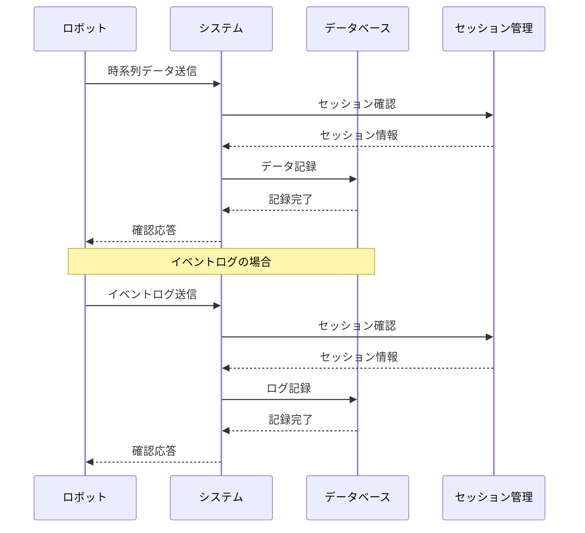
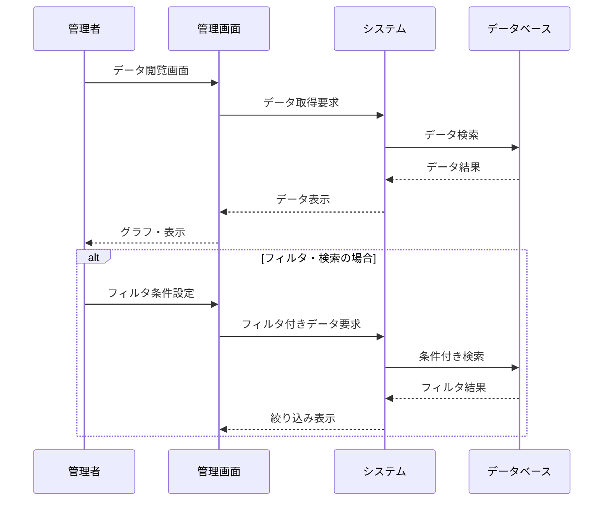
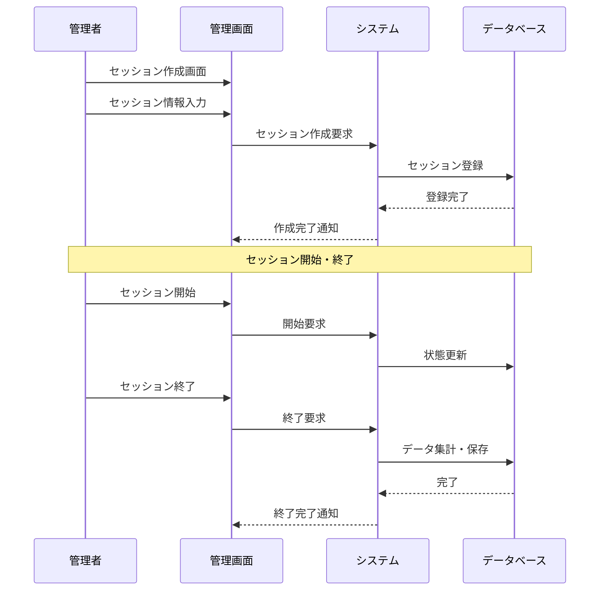

# データ管理機能 - シーケンス図

## UC3-1: データを記録する

```mermaid
sequenceDiagram
    participant Robot as ロボット
    participant System as システム
    participant DB as データベース
    participant Session as セッション管理

    Robot->>System: 時系列データ送信
    System->>Session: セッション確認
    Session-->>System: セッション情報
    System->>DB: データ記録
    DB-->>System: 記録完了
    System-->>Robot: 確認応答

    Note over Robot,DB: イベントログの場合
    Robot->>System: イベントログ送信
    System->>Session: セッション確認
    Session-->>System: セッション情報
    System->>DB: ログ記録
    DB-->>System: 記録完了
    System-->>Robot: 確認応答
```

## UC3-2: データを閲覧する

```mermaid
sequenceDiagram
    participant Admin as 管理者
    participant UI as 管理画面
    participant System as システム
    participant DB as データベース

    Admin->>UI: データ閲覧画面
    UI->>System: データ取得要求
    System->>DB: データ検索
    DB-->>System: データ結果
    System-->>UI: データ表示
    UI-->>Admin: グラフ・表示

    alt フィルタ・検索の場合
        Admin->>UI: フィルタ条件設定
        UI->>System: フィルタ付きデータ要求
        System->>DB: 条件付き検索
        DB-->>System: フィルタ結果
        System-->>UI: 絞り込み表示
    end
```

## UC3-3: 実験セッションを管理する

```mermaid
sequenceDiagram
    participant Admin as 管理者
    participant UI as 管理画面
    participant System as システム
    participant DB as データベース

    Admin->>UI: セッション作成画面
    Admin->>UI: セッション情報入力
    UI->>System: セッション作成要求
    System->>DB: セッション登録
    DB-->>System: 登録完了
    System-->>UI: 作成完了通知

    Note over Admin,DB: セッション開始・終了
    Admin->>UI: セッション開始
    UI->>System: 開始要求
    System->>DB: 状態更新
    Admin->>UI: セッション終了
    UI->>System: 終了要求
    System->>DB: データ集計・保存
    DB-->>System: 完了
    System-->>UI: 終了完了通知
```
