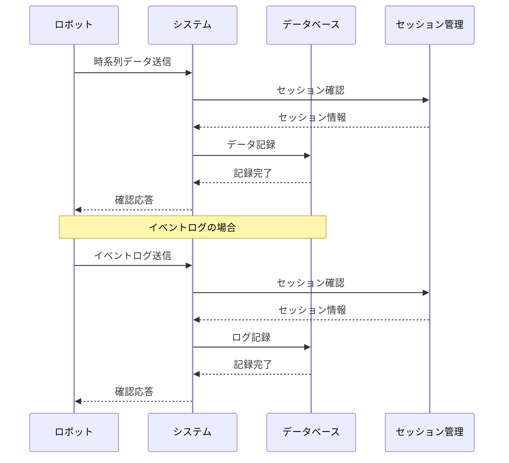

**[← 戻る](index.md)**

# UC3-1: データを記録する

## 概要

ロボットが時系列データやイベントログをシステムに記録する。

## アクター

- ロボット

## 事前条件

- ロボットがシステムに登録されている（UC1-1 の完了）
- システムが正常に動作している
- データベースが正常に動作している

## 事後条件

- データが正常に記録されている
- 実験セッション情報が適切に付与されている（実験期間中の場合）

## 基本フロー

1. ロボットがデータ（時系列データまたはイベントログ）をシステムに送信する
2. システムは現在の実験セッション設定を確認する
3. システムが以下の条件をチェックする：
   - データ受信時刻が実験期間内か
   - データ送信ロボットが実験対象か
4. 条件に合致する場合：
   - データに実験 ID とセッション情報を付与して記録する
5. 条件に合致しない場合：
   - データを通常データとして記録する
6. システムはデータの記録完了を確認する

## シーケンス図

---
