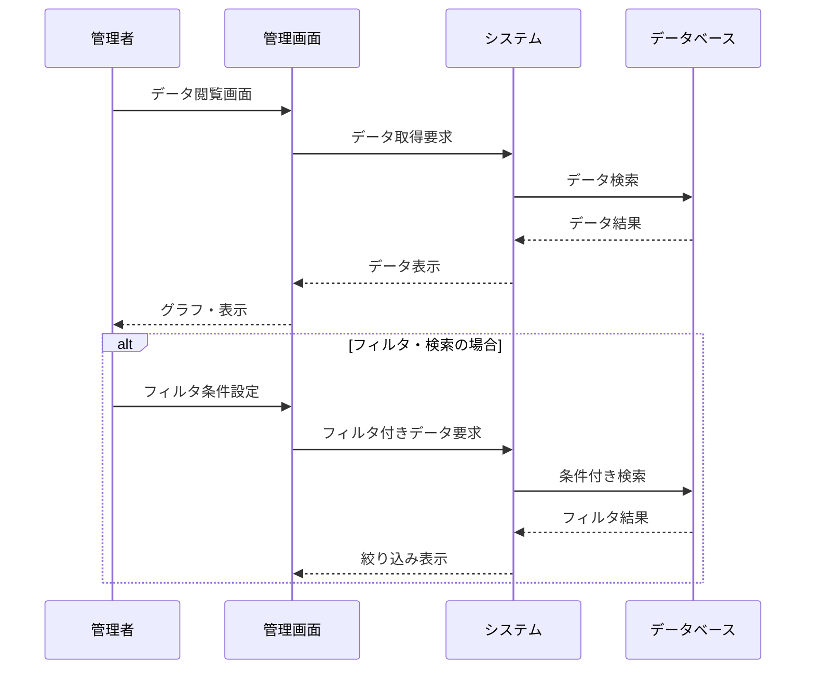

**[← 戻る](index.md)**

# UC3-2: データを閲覧する

## 概要

管理者がデータを管理画面で閲覧・分析する。

## アクター

- 管理者

## 事前条件

- 管理者が適切な権限を持っている
- システムが正常に動作している
- データベースが正常に動作している
- 閲覧対象のデータが存在している

## 事後条件

- 管理者が必要なデータにアクセスできている
- データが適切なフォーマットで表示されている

## 基本フロー

1. 管理者が管理画面にアクセスする
2. 管理者がデータの閲覧条件を設定する
   - データ種別（時系列データ/イベントログ）
   - 期間指定
   - 実験セッション指定（全体/特定実験）
   - ロボット個体指定
3. システムは指定された条件に基づいてデータを取得する
4. システムはデータを表示する（グラフ、テーブル、ダッシュボード形式）

## シーケンス図

---
