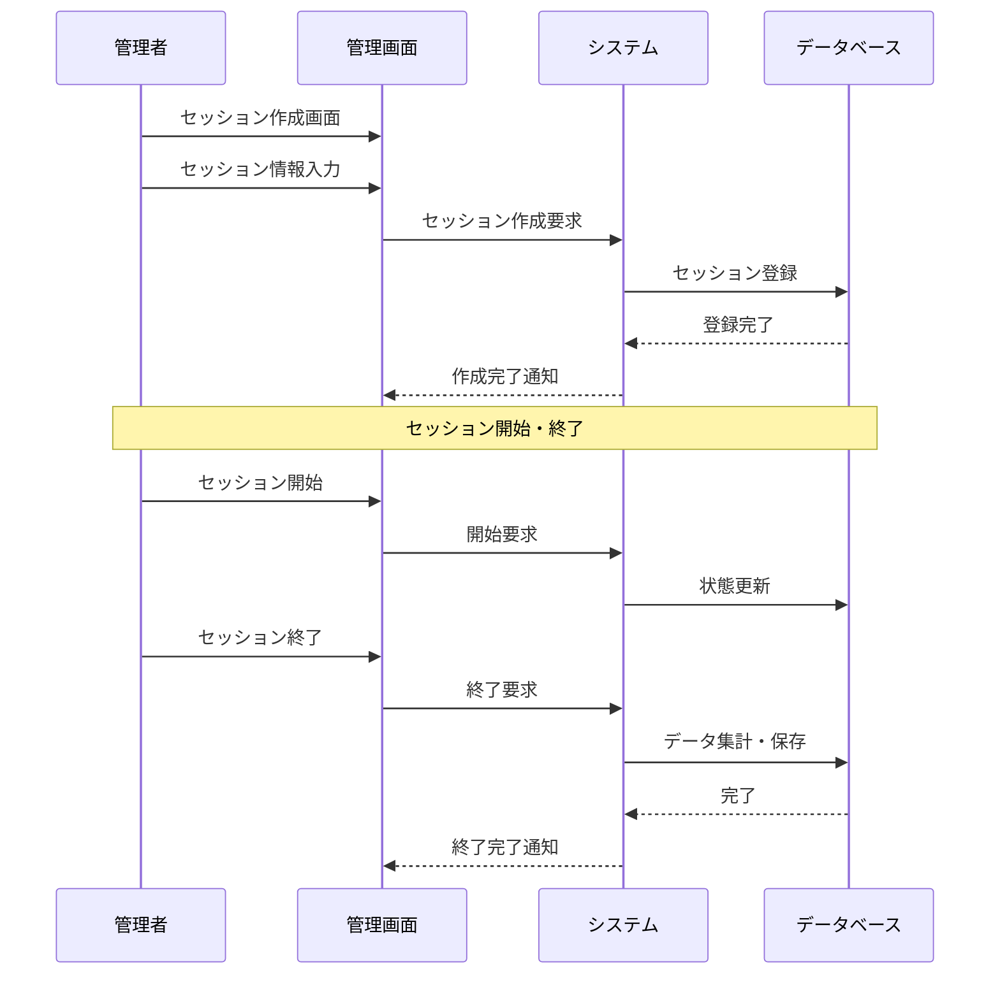

**[← 戻る](index.md)**

# UC3-3: 実験セッションを管理する

## 概要

管理者が実験セッションを作成・管理する。

## アクター

- 管理者

## 事前条件

- 管理者が適切な権限を持っている
- システムが正常に動作している
- データベースが正常に動作している
- 対象ロボットがシステムに登録されている

## 事後条件

- 実験セッションが適切に管理されている
- 実験期間中のデータが自動的に実験 ID と紐付けられる

## 基本フロー

1. 管理者が実験セッション管理画面にアクセスする
2. 管理者が実験セッションを作成する
   - 実験名、開始日時、終了日時、説明を設定
   - 対象ロボット個体を指定
   - 実験パラメータを設定
3. システムは実験セッションを作成・保存する
4. システムは既存セッションとの重複（同じロボットが複数実験に参加）をチェックする
5. 重複が検知された場合、エラーメッセージを表示し、作成を拒否する
6. 実験期間中、対象ロボットからのデータは自動的に実験 ID と紐付けられる
7. 管理者は実験セッションの状態を管理できる（開始/終了/削除）

## シーケンス図

---
