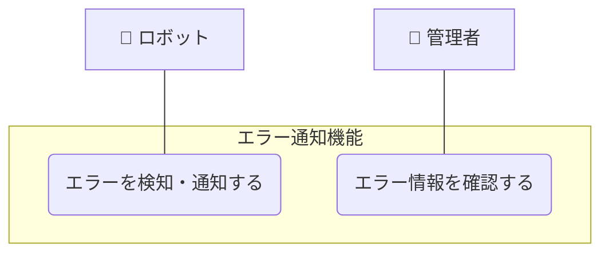

# エラー通知機能

## ユースケース一覧

| UC ID | ユースケース名         | 説明                                         |
| ----- | ---------------------- | -------------------------------------------- |
| UC4-1 | エラーを検知・通知する | ロボットがエラーを検知し、システムに通知する |
| UC4-2 | エラー情報を確認する   | 管理者がエラー情報を管理画面で閲覧する       |

## ユースケース図

## ユースケース記述

### 概要

ロボットがエラー（例：行動停止、充電失敗など）を検知した場合、システムにエラー情報を通知する。システムはエラー情報を記録し、重要度に応じて管理者や Slack 等に即時通知する。これにより、システムの異常を迅速に把握し、適切な対応を取ることができる。管理者は管理画面からエラー情報を確認・管理できる。

### アクター

- ロボット
- 管理者
- Slack（外部システム）

### 事前条件

- ロボットがシステムに登録されている（UC1-1 の完了）
- 管理者が適切な権限を持っている
- システムが正常に動作している
- Slack の連携設定が完了している

### 事後条件

- エラー情報が正常に記録されている
- 必要に応じて通知が送信されている
- 管理者がエラー情報を確認できる

### 基本フロー

#### UC4-1: エラーを検知・通知する

1. ロボットがエラー（例：障害、充電失敗、行動停止など）を検知する
2. ロボットはエラーの詳細情報を取得する
3. ロボットはエラー情報をシステムに送信する
4. システムはエラー情報を受信し、確認応答を返す
5. システムはエラー情報をデータベースに記録する
6. システムはエラーの重要度を評価する
7. システムはエラーの重要度に基づいて通知の必要性を判断する
8. 通知が必要な場合、システムは通知メッセージを作成し、Slack に送信する

#### UC4-2: エラー情報を確認する

1. 管理者が管理画面にアクセスする
2. 管理者がエラー情報確認画面を開く
3. システムはエラー情報の一覧を表示する
4. 管理者は特定のエラーの詳細情報を閲覧する
5. 管理者は必要に応じてエラーの対処状況を更新する

### 例外フロー

#### エラー検知・通知エラー時

- エラー情報の送信に失敗した場合、ロボットは再送信を試行する
- システムがエラー情報を受信できない場合、ロボットはローカルにエラーログを保存する
- データベースへの記録に失敗した場合、システムはファイルシステムに一時保存する
- Slack への通知に失敗した場合、システムは再送信を試行する
- 再送信に失敗した場合、システムは管理者への別経路通知（メール等）を行う

#### エラー情報確認エラー時

- エラー情報の取得に失敗した場合、エラーメッセージを表示する
- 権限がないエラー情報にアクセスした場合、アクセス拒否メッセージを表示する
- エラー情報の更新に失敗した場合、エラーメッセージを表示し、再試行を促す

## その他・検討
- エラー対応完了を記録できるようにする

## 他のユースケースとの関連

このユースケースは、システム全体のエラー監視と通知を担当します。詳細な関連性については、以下のドキュメントを参照してください：

📖 **[ユースケース間の関連](../usecase_relationships.md)**

## 関連ファイル

- [シーケンス図](sequence.mmd)
- [API 仕様](api_spec.md)
- [クラス図](class_diagram.pu)
