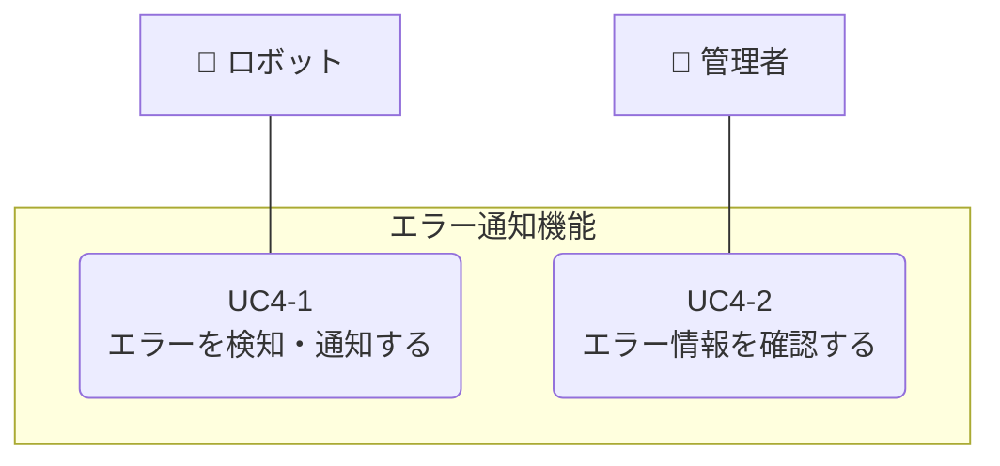

# エラー通知機能

**[← ユースケースに戻る](../index.md)**

## 概要

ロボットがエラー（例：行動停止、充電失敗など）を検知した場合、システムにエラー情報を通知する。システムはエラー情報を記録し、重要度に応じて管理者や Slack 等に即時通知する。これにより、システムの異常を迅速に把握し、適切な対応を取ることができる。管理者は管理画面からエラー情報を確認・管理できる。

## ユースケース一覧

| UC ID | ユースケース名         | 説明                                         | 詳細               |
| ----- | ---------------------- | -------------------------------------------- | ------------------ |
| UC4-1 | エラーを検知・通知する | ロボットがエラーを検知し、システムに通知する | [詳細](uc04_01.md) |
| UC4-2 | エラー情報を確認する   | 管理者がエラー情報を管理画面で閲覧する       | [詳細](uc04_02.md) |

## ユースケース図

## 関連ドキュメント

- [📖 ユースケース間の関連](../usecase_relationships.md)
