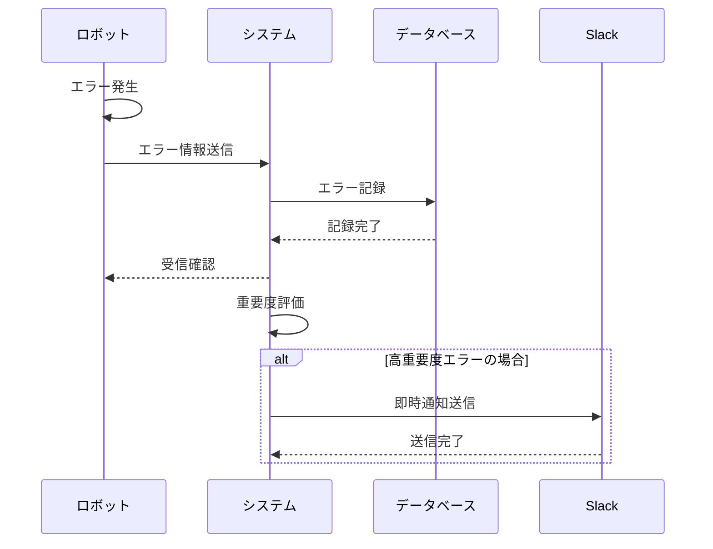
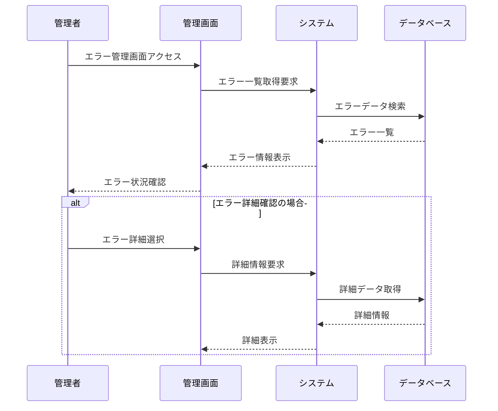

# エラー通知機能 - シーケンス図

## UC4-1: エラーを検知・通知する

```mermaid
sequenceDiagram
    participant Robot as ロボット
    participant System as システム
    participant DB as データベース
    participant Slack as Slack

    Robot->>Robot: エラー発生
    Robot->>System: エラー情報送信
    System->>DB: エラー記録
    DB-->>System: 記録完了
    System-->>Robot: 受信確認

    System->>System: 重要度評価
    alt 高重要度エラーの場合
        System->>Slack: 即時通知送信
        Slack-->>System: 送信完了
    end
```

## UC4-2: エラー情報を確認する

```mermaid
sequenceDiagram
    participant Admin as 管理者
    participant UI as 管理画面
    participant System as システム
    participant DB as データベース

    Admin->>UI: エラー管理画面アクセス
    UI->>System: エラー一覧取得要求
    System->>DB: エラーデータ検索
    DB-->>System: エラー一覧
    System-->>UI: エラー情報表示
    UI-->>Admin: エラー状況確認

    alt エラー詳細確認の場合
        Admin->>UI: エラー詳細選択
        UI->>System: 詳細情報要求
        System->>DB: 詳細データ取得
        DB-->>System: 詳細情報
        System-->>UI: 詳細表示
    end
```
