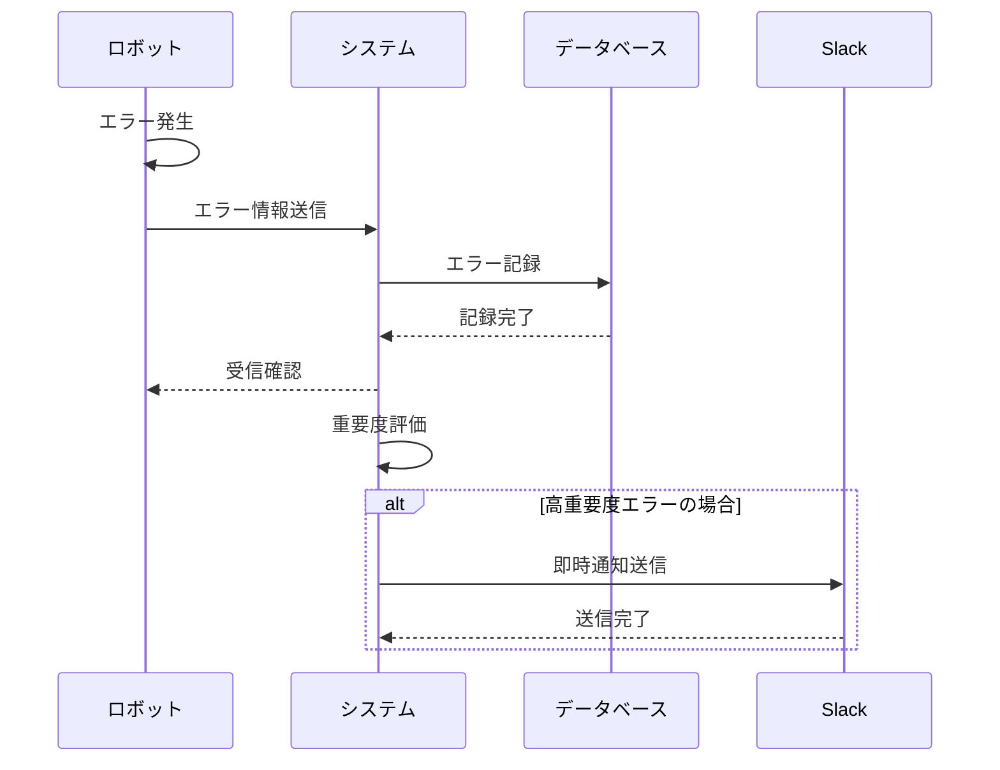

# UC4-1: エラーを検知・通知する

**[← 戻る](./index.md)**

## 基本フロー

1. ロボットがエラー（例：障害、充電失敗、行動停止など）を検知する
2. ロボットはエラーの詳細情報を取得する
3. ロボットはエラー情報をシステムに送信する
4. システムはエラー情報を受信し、確認応答を返す
5. システムはエラー情報をデータベースに記録する
6. システムはエラーの重要度を評価する
7. システムはエラーの重要度に基づいて通知の必要性を判断する
8. 通知が必要な場合、システムは通知メッセージを作成し、Slack に送信する

## シーケンス図

## 関連情報

- **アクター**: ロボット、システム、Slack
- **事前条件**: ロボットがシステムに登録されている、システムが正常動作している、Slack 連携設定が完了している
- **事後条件**: エラー情報が記録されている、必要に応じて通知が送信されている
