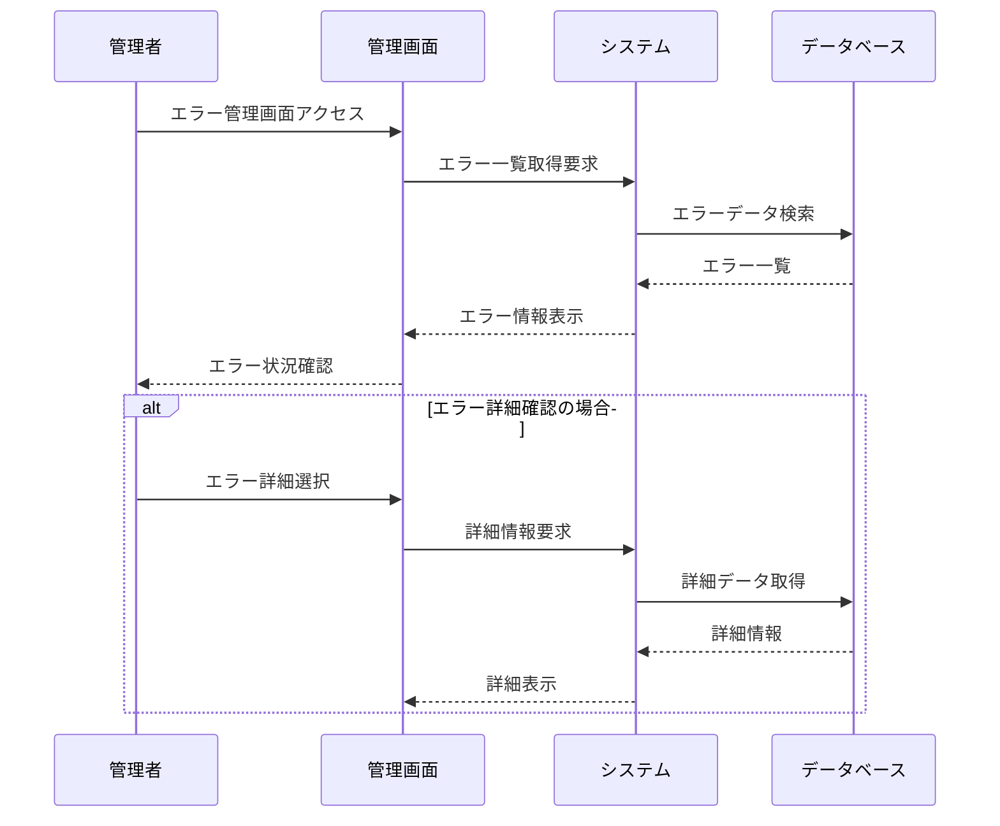

# UC4-2: エラー情報を確認する

**[← 戻る](./index.md)**

## 基本フロー

1. 管理者が管理画面にアクセスする
2. 管理者がエラー情報確認画面を開く
3. システムはエラー情報の一覧を表示する
4. 管理者は特定のエラーの詳細情報を閲覧する
5. 管理者は必要に応じてエラーの対処状況を更新する

## シーケンス図

## 関連情報

- **アクター**: 管理者、管理画面、システム
- **事前条件**: 管理者が適切な権限を持っている、システムが正常動作している
- **事後条件**: 管理者がエラー情報を確認できる
