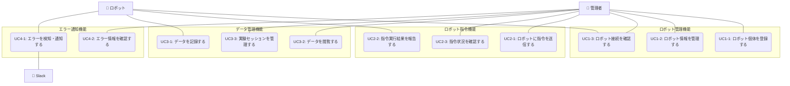

**[← ドキュメント一覧に戻る](../index.md)**

# ユースケース概要

## アクター一覧

- **管理者**: 管理画面から指令を出したり情報を閲覧する人
- **ロボット**: 指令に応じて行動し、状態やエラーを返すハードウェア
- **Slack**: システムからの通知を受け取る外部サービス

## ユースケース一覧

* UC01 - [ロボット管理機能](UC01_robot_management/index.md)
* UC02 - [ロボット指令機能](UC02_robot_command/index.md)
* UC03 - [データ管理機能](UC03_data_management/index.md)
* UC04 - [エラー通知機能](UC04_error_notification/index.md) 

## 全体ユースケース図

## ユースケース間の関連

各ユースケース間の関連性と依存関係については、以下のドキュメントを参照してください：
📖 **[ユースケース間の関連](usecase_relationships.md)**

## 関連ドキュメント

- [機能要求仕様](../10_requirements/functional_requirements.md)
