# ロボットクラウドシステム ユースケース概要

## アクター一覧

- **管理者**: 管理画面から指令を出したり情報を閲覧する人
- **ロボット**: 指令に応じて行動し、状態やエラーを返すハードウェア
- **Slack**: システムからの通知を受け取る外部サービス

## 機能別ユースケース一覧

### 1. ロボット管理機能（UC1-x）

| UC ID | ユースケース名         | 説明                                             | 詳細                                   |
| ----- | ---------------------- | ------------------------------------------------ | -------------------------------------- |
| UC1-1 | ロボット個体を登録する | 管理者が新しいロボット個体をシステムに登録する   | [詳細](UC01_robot_management/index.md) |
| UC1-2 | ロボット情報を管理する | 管理者がロボット個体の情報を閲覧・更新・削除する | [詳細](UC01_robot_management/index.md) |
| UC1-3 | ロボット接続を確認する | 管理者がロボット個体との通信状態を確認する       | [詳細](UC01_robot_management/index.md) |

### 2. ロボット指令機能（UC2-x）

| UC ID | ユースケース名           | 説明                                         | 詳細                                |
| ----- | ------------------------ | -------------------------------------------- | ----------------------------------- |
| UC2-1 | ロボットに指令を送信する | 管理者がロボットに行動指令を送信する         | [詳細](UC02_robot_command/index.md) |
| UC2-2 | 指令実行結果を報告する   | ロボットが指令の実行結果をシステムに報告する | [詳細](UC02_robot_command/index.md) |
| UC2-3 | 指令状況を確認する       | 管理者が指令の実行状況を管理画面で確認する   | [詳細](UC02_robot_command/index.md) |

### 3. データ管理機能（UC3-x）

| UC ID | ユースケース名           | 説明                                                     | 詳細                                  |
| ----- | ------------------------ | -------------------------------------------------------- | ------------------------------------- |
| UC3-1 | データを記録する         | ロボットが時系列データやイベントログをシステムに記録する | [詳細](UC03_data_management/index.md) |
| UC3-2 | データを閲覧する         | 管理者がデータを管理画面で閲覧・分析する                 | [詳細](UC03_data_management/index.md) |
| UC3-3 | 実験セッションを管理する | 管理者が実験セッションを作成・管理する                   | [詳細](UC03_data_management/index.md) |

### 4. エラー通知機能（UC4-x）

| UC ID | ユースケース名         | 説明                                         | 詳細                                     |
| ----- | ---------------------- | -------------------------------------------- | ---------------------------------------- |
| UC4-1 | エラーを検知・通知する | ロボットがエラーを検知し、システムに通知する | [詳細](UC04_error_notification/index.md) |
| UC4-2 | エラー情報を確認する   | 管理者がエラー情報を管理画面で閲覧する       | [詳細](UC04_error_notification/index.md) |

## 全体ユースケース図

```mermaid
graph TD
    Admin["👤 管理者"]
    Robot["🤖 ロボット"]
    Slack["💬 Slack"]

    subgraph ロボット管理機能
        UC1-1(UC1-1: ロボット個体を登録する)
        UC1-2(UC1-2: ロボット情報を管理する)
        UC1-3(UC1-3: ロボット接続を確認する)
    end

    subgraph ロボット指令機能
        UC2-1(UC2-1: ロボットに指令を送信する)
        UC2-2(UC2-2: 指令実行結果を報告する)
        UC2-3(UC2-3: 指令状況を確認する)
    end

    subgraph データ管理機能
        UC3-1(UC3-1: データを記録する)
        UC3-2(UC3-2: データを閲覧する)
        UC3-3(UC3-3: 実験セッションを管理する)
    end

    subgraph エラー通知機能
        UC4-1(UC4-1: エラーを検知・通知する)
        UC4-2(UC4-2: エラー情報を確認する)
    end

    %% ロボット管理機能の関係
    Admin --- UC1-1
    Admin --- UC1-2
    Admin --- UC1-3
    Robot --- UC1-3

    %% ロボット指令機能の関係
    Admin --- UC2-1
    Robot --- UC2-2
    Admin --- UC2-3

    %% データ管理機能の関係
    Robot --- UC3-1
    Admin --- UC3-2
    Admin --- UC3-3

    %% エラー通知機能の関係
    Robot --- UC4-1
    Admin --- UC4-2
```

## 機能別ドキュメント

各機能の詳細なユースケース記述は、以下のドキュメントを参照してください：

- [ロボット管理機能](UC01_robot_management/index.md)
- [ロボット指令機能](UC02_robot_command/index.md)
- [データ管理機能](UC03_data_management/index.md)
- [エラー通知機能](UC04_error_notification/index.md)

## ユースケース間の関連

各ユースケース間の関連性と依存関係については、以下のドキュメントを参照してください：

📖 **[ユースケース間の関連](usecase_relationships.md)**

## 関連ドキュメント

- [機能要求仕様](../10_requirements/functional_requirements.md)
- [システム設計](../30_architecture/system_architecture.md)
