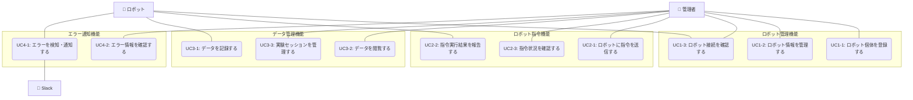

# ロボットクラウドシステム ユースケース概要

## アクター一覧

- **管理者**: 管理画面から指令を出したり情報を閲覧する人
- **ロボット**: 指令に応じて行動し、状態やエラーを返すハードウェア
- **Slack**: システムからの通知を受け取る外部サービス

## 機能別ユースケース一覧

### 1. ロボット管理機能（UC1-x）

| UC ID | ユースケース名         | 説明                                             | 詳細                                   |
| ----- | ---------------------- | ------------------------------------------------ | -------------------------------------- |
| UC1-1 | ロボット個体を登録する | 管理者が新しいロボット個体をシステムに登録する   | [詳細](UC01_robot_management/index.md) |
| UC1-2 | ロボット情報を管理する | 管理者がロボット個体の情報を閲覧・更新・削除する | [詳細](UC01_robot_management/index.md) |
| UC1-3 | ロボット接続を確認する | 管理者がロボット個体との通信状態を確認する       | [詳細](UC01_robot_management/index.md) |

**概要**: システムの基盤機能として、ロボット個体の登録・管理・接続確認を提供。他のすべてのユースケースの前提条件となる重要な機能。

### 2. ロボット指令機能（UC2-x）

| UC ID | ユースケース名           | 説明                                         | 詳細                                |
| ----- | ------------------------ | -------------------------------------------- | ----------------------------------- |
| UC2-1 | ロボットに指令を送信する | 管理者がロボットに行動指令を送信する         | [詳細](UC02_robot_command/index.md) |
| UC2-2 | 指令実行結果を報告する   | ロボットが指令の実行結果をシステムに報告する | [詳細](UC02_robot_command/index.md) |
| UC2-3 | 指令状況を確認する       | 管理者が指令の実行状況を管理画面で確認する   | [詳細](UC02_robot_command/index.md) |

**概要**: 管理者とロボット間のリアルタイム指令送信・実行・監視を実現。充電、巡回、停止などの基本的な行動指令をサポート。

### 3. データ管理機能（UC3-x）

| UC ID | ユースケース名           | 説明                                                     | 詳細                                  |
| ----- | ------------------------ | -------------------------------------------------------- | ------------------------------------- |
| UC3-1 | データを記録する         | ロボットが時系列データやイベントログをシステムに記録する | [詳細](UC03_data_management/index.md) |
| UC3-2 | データを閲覧する         | 管理者がデータを管理画面で閲覧・分析する                 | [詳細](UC03_data_management/index.md) |
| UC3-3 | 実験セッションを管理する | 管理者が実験セッションを作成・管理する                   | [詳細](UC03_data_management/index.md) |

**概要**: ロボットの時系列データ・イベントログの記録と管理。実験セッション機能により、特定の実験に関連するデータを区別して管理可能。異なるロボットでの複数実験の同時実行をサポート。

**特別機能**:

- 📖 **[実験セッションの概念](UC03_data_management/experiment_session.md)** - 実験セッションの詳細説明

### 4. エラー通知機能（UC4-x）

| UC ID | ユースケース名         | 説明                                         | 詳細                                     |
| ----- | ---------------------- | -------------------------------------------- | ---------------------------------------- |
| UC4-1 | エラーを検知・通知する | ロボットがエラーを検知し、システムに通知する | [詳細](UC04_error_notification/index.md) |
| UC4-2 | エラー情報を確認する   | 管理者がエラー情報を管理画面で閲覧する       | [詳細](UC04_error_notification/index.md) |

**概要**: ロボットのエラー検知から Slack 通知、管理画面での確認まで一貫したエラー管理システム。重要度に応じた通知制御により迅速な対応を可能にする。

## 全体ユースケース図

## 機能間の依存関係

### 基盤機能（必須前提条件）

- **UC1-1（ロボット個体登録）**: 全システムの基盤となる必須機能
- すべての他機能は UC1-1 の完了を前提とする

### データ連携

- **UC1-3 → UC3-1**: 接続テスト結果をイベントログとして記録
- **UC2-1, UC2-2 → UC3-1**: 指令送信・実行結果をイベントログとして記録
- **UC4-1 → UC3-1**: エラー発生をイベントログとして記録

### 情報参照

- **UC3-2**: 指令履歴・エラー履歴の閲覧が可能
- **UC4-2**: エラー情報とロボット詳細情報の統合表示

## 技術実装ファイル

各ユースケースには以下の実装文書が付属しています：

### UC01 - ロボット管理機能

- [シーケンス図](UC01_robot_management/sequence.md)
- [API 仕様](UC01_robot_management/api_spec.md)
- [クラス図](UC01_robot_management/class_diagram.pu)

### UC02 - ロボット指令機能

- [シーケンス図](UC02_robot_command/sequence.mmd)
- [API 仕様](UC02_robot_command/api_spec.md)
- [クラス図](UC02_robot_command/class_diagram.pu)

### UC03 - データ管理機能

- [シーケンス図](UC03_data_management/sequence.mmd) / [sequence.md](UC03_data_management/sequence.md)
- [API 仕様](UC03_data_management/api_spec.md)
- [クラス図](UC03_data_management/class_diagram.pu)
- [実験セッション詳細](UC03_data_management/experiment_session.md)

### UC04 - エラー通知機能

- [シーケンス図](UC04_error_notification/sequence.md)
- [API 仕様](UC04_error_notification/api_spec.md)
- [クラス図](UC04_error_notification/class_diagram.pu)

## ユースケース間の関連

各ユースケース間の関連性と依存関係については、以下のドキュメントを参照してください：

📖 **[ユースケース間の関連](usecase_relationships.md)**

## 関連ドキュメント

- [機能要求仕様](../10_requirements/functional_requirements.md)
- [システムアーキテクチャ](../00_overview/system_architecture.md)
