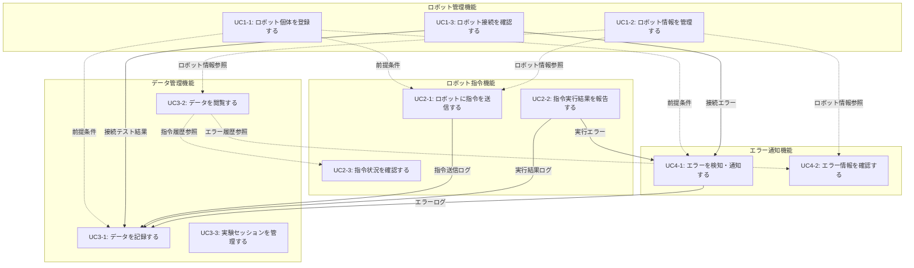

# ユースケース間の関連

## 概要

本ドキュメントでは、ロボットクラウドシステムの各ユースケース間の関連性と依存関係について詳細に説明します。各機能は相互に連携し、統合されたシステムとして動作します。

## 全体関連図

## 依存関係

### 必須の前提条件

1. **UC1-1（ロボット個体登録）は全システムの基盤**

   - すべての機能の前提条件
   - この機能なしでは他の機能は動作しない

2. **管理者権限の設定**
   - 各機能で適切な権限が必要
   - セキュリティの基盤となる

### データ整合性の保証

1. **ロボット ID の一意性**

   - UC1-1 で保証された ID がシステム全体で使用される
   - データの整合性を保証

2. **実験セッションとデータの関連付け**
   - UC3-3 で作成されたセッションが UC3-1 で自動適用される
   - 実験データの正確な分類を保証

### パフォーマンスへの考慮

1. **同時実行の制御**

   - 複数のユースケースが同時実行される際の競合状態の回避
   - データベースアクセスの最適化

2. **エラー処理の連携**
   - 各機能でのエラーが UC4 系に適切に連携される
   - システム全体の監視と診断が可能

## 関連ドキュメント

- [ユースケース概要](index.md)
- [ロボット管理機能](UC01_robot_management/index.md)
- [ロボット指令機能](UC02_robot_command/index.md)
- [データ管理機能](UC03_data_management/index.md)
- [エラー通知機能](UC04_error_notification/index.md)
- [機能要求仕様](../10_requirements/functional_requirements.md)
