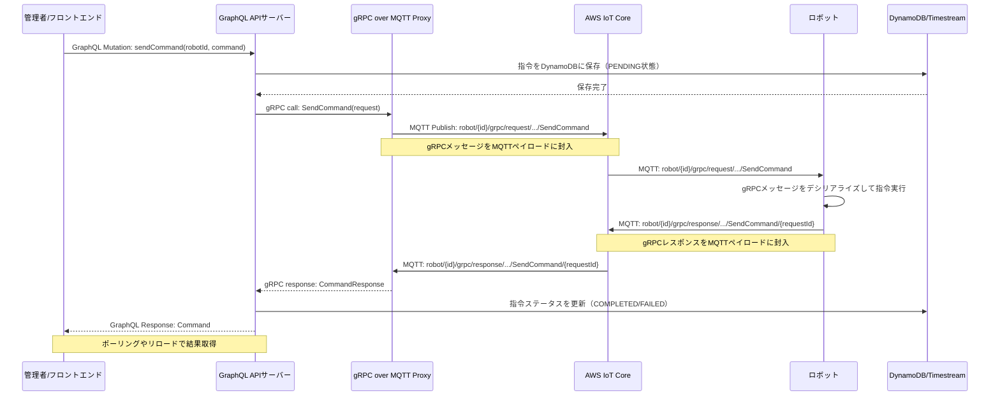

# ロボット指令の通信フロー

## 概要

GraphQL API サーバーと gRPC over MQTT proxy を使用したロボット指令の通信フローを説明します。この実装では、WebSocket を使用せず、ポーリングやリロードによる結果取得を前提としています。

## 通信フロー図



## 詳細な通信フロー

### 1. **管理者からの指令送信**

```typescript
// フロントエンド（管理者）からのGraphQL Mutation
const SEND_COMMAND = gql`
  mutation SendCommand($robotId: ID!, $command: CommandInput!) {
    sendCommand(robotId: $robotId, command: $command) {
      id
      type
      status
      createdAt
      executedAt
    }
  }
`;

// 指令送信例
const result = await sendCommand({
  variables: {
    robotId: "robot-001",
    command: {
      type: "MOVE",
      parameters: { x: 10, y: 20, speed: 0.5 },
    },
  },
});

// 結果の監視（ポーリング）
const pollCommandStatus = async (commandId: string) => {
  const POLL_INTERVAL = 1000; // 1秒間隔

  const checkStatus = async () => {
    const { data } = await apolloClient.query({
      query: GET_COMMAND_STATUS,
      variables: { commandId },
      fetchPolicy: "network-only", // キャッシュを無視
    });

    if (
      data.command.status === "COMPLETED" ||
      data.command.status === "FAILED"
    ) {
      return data.command;
    }

    // まだ実行中の場合は継続してポーリング
    await new Promise((resolve) => setTimeout(resolve, POLL_INTERVAL));
    return checkStatus();
  };

  return await checkStatus();
};
```

### 2. **GraphQL サーバーでの処理**

```typescript
// GraphQL Resolver
const resolvers = {
  Mutation: {
    sendCommand: async (_, { robotId, command }) => {
      // 1. DynamoDBに指令を保存（PENDING状態）
      const savedCommand = await saveCommandToDB({
        robotId,
        type: command.type,
        parameters: command.parameters,
        status: "PENDING",
        createdAt: new Date(),
      });

      // 2. gRPC Proxyに指令を転送
      const grpcResponse = await grpcClient.sendCommand({
        robot_id: robotId,
        command_type: mapCommandType(command.type),
        parameters: Buffer.from(JSON.stringify(command.parameters)),
      });

      // 3. レスポンスを返す
      return {
        id: savedCommand.id,
        type: command.type,
        status: mapGrpcStatus(grpcResponse.status),
        createdAt: savedCommand.createdAt,
        executedAt: grpcResponse.executed_at
          ? new Date(grpcResponse.executed_at)
          : null,
      };
    },
  },
  Query: {
    command: async (_, { id }) => {
      return await getCommandFromDB(id);
    },
    commands: async (_, { robotId, limit = 10 }) => {
      return await getCommandsFromDB(robotId, limit);
    },
  },
};
```

### 3. **gRPC over MQTT Proxy での処理**

```typescript
// gRPC Proxy実装
class GRPCMQTTProxy {
  async sendCommand(call: any, callback: any) {
    const request = call.request;
    const requestId = this.generateRequestId();

    // MQTTトピックにgRPCリクエストを送信
    const topic = `robot/${request.getRobotId()}/grpc/request/robot.control.RobotControlService/SendCommand`;
    const payload = {
      requestId,
      data: request.serializeBinary(),
      timestamp: Date.now(),
    };

    // レスポンス待ちキューに追加
    this.pendingRequests.set(requestId, {
      callback,
      timeout: Date.now() + 30000,
      robotId: request.getRobotId(),
    });

    // MQTTで送信
    await this.mqttClient.publish(topic, JSON.stringify(payload));

    // タイムアウト処理
    setTimeout(() => {
      const pendingRequest = this.pendingRequests.get(requestId);
      if (pendingRequest) {
        pendingRequest.callback(new Error("Command timeout"), null);
        this.pendingRequests.delete(requestId);
      }
    }, 30000);
  }

  private handleMQTTMessage(topic: string, message: Buffer) {
    if (topic.includes("/grpc/response/")) {
      const payload = JSON.parse(message.toString());
      const requestId = payload.requestId;

      const pendingRequest = this.pendingRequests.get(requestId);
      if (pendingRequest) {
        const response = CommandResponse.deserializeBinary(payload.data);
        pendingRequest.callback(null, response);
        this.pendingRequests.delete(requestId);
      }
    }
  }
}
```

### 4. **ロボット側での処理**

```typescript
// ロボット側のgRPC over MQTT処理
class RobotGRPCHandler {
  constructor() {
    this.mqttClient = mqtt.connect(process.env.MQTT_BROKER_URL);
    this.setupMQTTHandlers();
  }

  private setupMQTTHandlers() {
    // gRPCリクエストを受信
    this.mqttClient.subscribe("robot/+/grpc/request/+/+");

    this.mqttClient.on("message", (topic, message) => {
      if (topic.includes("/grpc/request/")) {
        this.handleGRPCRequest(topic, message);
      }
    });
  }

  private async handleGRPCRequest(topic: string, message: Buffer) {
    const payload = JSON.parse(message.toString());
    const requestId = payload.requestId;

    try {
      // gRPCメッセージをデシリアライズ
      const request = CommandRequest.deserializeBinary(payload.data);

      // 指令を実行
      const result = await this.executeCommand(request);

      // レスポンスを送信
      const response = new CommandResponse();
      response.setCommandId(requestId);
      response.setStatus(
        result.success ? CommandStatus.COMPLETED : CommandStatus.FAILED
      );
      response.setMessage(result.message);

      const responseTopic =
        topic.replace("/request/", "/response/") + "/" + requestId;
      const responsePayload = {
        requestId,
        data: response.serializeBinary(),
      };

      await this.mqttClient.publish(
        responseTopic,
        JSON.stringify(responsePayload)
      );
    } catch (error) {
      // エラーレスポンスを送信
      const errorResponse = new CommandResponse();
      errorResponse.setCommandId(requestId);
      errorResponse.setStatus(CommandStatus.FAILED);
      errorResponse.setMessage(error.message);

      const responseTopic =
        topic.replace("/request/", "/response/") + "/" + requestId;
      const responsePayload = {
        requestId,
        data: errorResponse.serializeBinary(),
      };

      await this.mqttClient.publish(
        responseTopic,
        JSON.stringify(responsePayload)
      );
    }
  }

  private async executeCommand(request: CommandRequest) {
    const commandType = request.getCommandType();
    const parameters = JSON.parse(request.getParameters().toString());

    switch (commandType) {
      case CommandType.MOVE:
        return await this.moveRobot(
          parameters.x,
          parameters.y,
          parameters.speed
        );
      case CommandType.ROTATE:
        return await this.rotateRobot(parameters.angle);
      case CommandType.GRAB:
        return await this.grabObject(parameters.objectId);
      case CommandType.RELEASE:
        return await this.releaseObject();
      case CommandType.EMERGENCY_STOP:
        return await this.emergencyStop();
      default:
        throw new Error(`Unknown command type: ${commandType}`);
    }
  }
}
```

## 結果取得パターン

### 1. **ポーリング（推奨）**

```typescript
// 定期的にステータスを確認
const pollCommandStatus = async (commandId: string) => {
  const POLL_INTERVAL = 1000; // 1秒間隔
  const MAX_ATTEMPTS = 60; // 最大60回（1分）

  for (let i = 0; i < MAX_ATTEMPTS; i++) {
    const { data } = await apolloClient.query({
      query: GET_COMMAND_STATUS,
      variables: { commandId },
      fetchPolicy: "network-only",
    });

    if (data.command.status !== "PENDING") {
      return data.command;
    }

    await new Promise((resolve) => setTimeout(resolve, POLL_INTERVAL));
  }

  throw new Error("Command timeout");
};
```

### 2. **手動リロード**

```typescript
// ボタンクリックでステータス更新
const handleRefreshStatus = async () => {
  setLoading(true);
  try {
    const { data } = await apolloClient.query({
      query: GET_COMMAND_STATUS,
      variables: { commandId },
      fetchPolicy: "network-only",
    });
    setCommand(data.command);
  } catch (error) {
    setError(error.message);
  } finally {
    setLoading(false);
  }
};
```

## MQTT トピック設計

```
# 指令送信
robot/{robot_id}/grpc/request/robot.control.RobotControlService/SendCommand

# 指令応答
robot/{robot_id}/grpc/response/robot.control.RobotControlService/SendCommand/{request_id}

# 状態監視（従来のMQTT）
robot/{robot_id}/status
robot/{robot_id}/battery
robot/{robot_id}/location
robot/{robot_id}/error

# 例
robot/robot-001/grpc/request/robot.control.RobotControlService/SendCommand
robot/robot-001/grpc/response/robot.control.RobotControlService/SendCommand/req-123456
```

## エラーハンドリング

### 1. **タイムアウト処理**

- gRPC Proxy で 30 秒タイムアウト
- フロントエンドでの適切なタイムアウト設定
- ロボット応答なしの場合のステータス更新

### 2. **ネットワークエラー**

- MQTT 接続断の自動再接続
- メッセージの重複送信防止
- 指令の冪等性確保

### 3. **ロボットエラー**

- 指令実行失敗時の詳細エラー情報
- 緊急停止機能の優先実行
- エラー状態の永続化

## パフォーマンス最適化

### 1. **メッセージ圧縮**

- Protocol Buffers による効率的なシリアライゼーション
- MQTT QoS 設定による信頼性確保

### 2. **接続プール**

- gRPC Proxy での接続再利用
- MQTT 接続の永続化

### 3. **キャッシュ戦略**

- GraphQL キャッシュの適切な無効化
- ロボット状態のキャッシュ
- 頻繁な指令のバッチ処理

### 4. **ポーリング最適化**

- 適切なポーリング間隔の設定
- 指数バックオフによる負荷軽減
- 完了済み指令のポーリング停止

この通信フローにより、WebSocket を使用せずに効率的で安定したロボット制御が実現できます。
