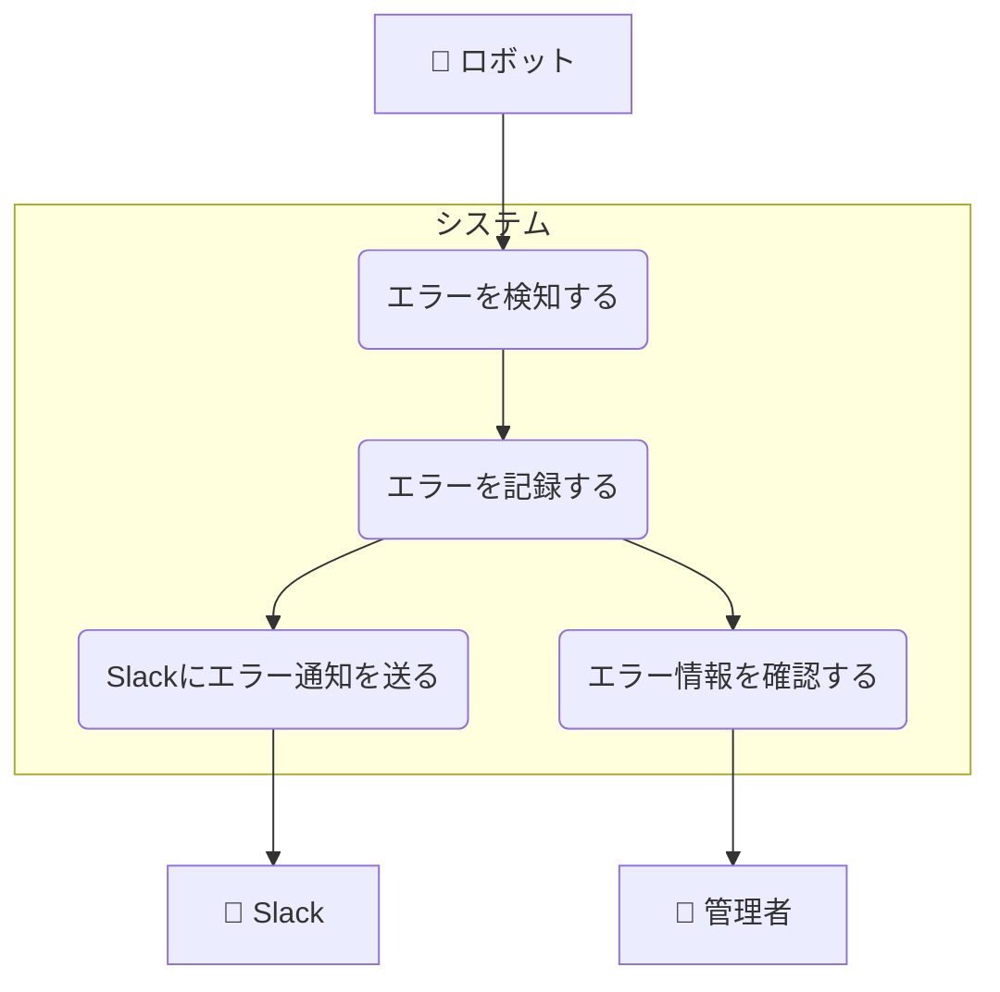

# エラー通知ユースケース

## ユースケース一覧

| UC ID | ユースケース名           | 説明                                         |
| ----- | ------------------------ | -------------------------------------------- |
| UC1-1 | エラーを検知する         | ロボットがエラーを検知し、システムに送信する |
| UC1-2 | エラーを記録する         | システムがエラー情報をデータベースに記録する |
| UC1-3 | Slack にエラー通知を送る | システムが検知したエラーを Slack に通知する  |
| UC1-4 | エラー情報を確認する     | 管理者がエラー情報を管理画面で閲覧する       |

## ユースケース図

## ユースケース記述

### 概要

ロボットがエラー（例：行動停止、充電失敗など）を検知した場合、システムは管理者や Slack 等に即時通知する。

### アクター

- ロボット
- 管理者
- Slack（外部システム）

### 基本フロー

1. ロボットがエラー（例：障害、充電失敗、行動停止など）を検知する。
2. ロボットはエラー情報をシステムに送信する。
3. システムはエラーを記録し Slack に送信する。
4. 管理者はエラーを閲覧でき Slack は通知を受信する。

### 代替フロー

- 通知が失敗した場合、再送処理や管理者への別経路通知（メール等）を行う。
