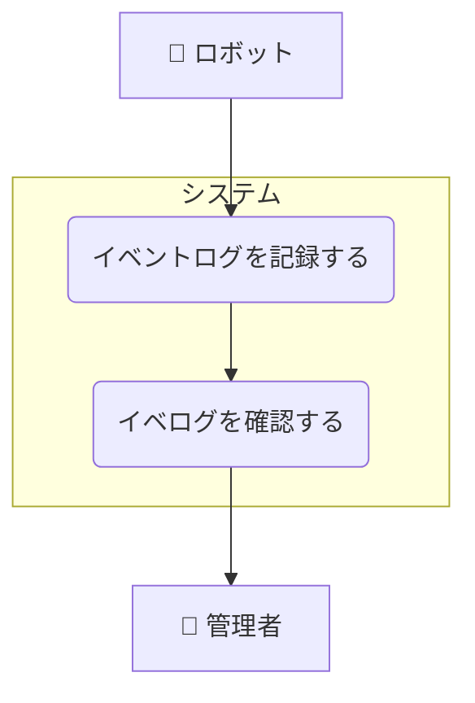

# イベントログ管理ユースケース

## ユースケース一覧

| UC ID | ユースケース名         | 説明                                       |
| ----- | ---------------------- | ------------------------------------------ |
| UC4-1 | イベントログを記録する | ロボットがイベントログをシステムに記録する |
| UC4-2 | イベログを確認する     | 管理者がイベントログを管理画面で確認する   |

## ユースケース図

## ユースケース記述

### 概要

ロボットは充電開始・終了など、さまざまなイベントをシステムに記録し、システムはこれをイベントログとして記録する。管理者は管理画面からイベントログを閲覧できる。(エラーとは明確に区別される)

### アクター

- ロボット
- 管理者

### 基本フロー

1. ロボットがイベント（充電開始・終了など）をシステムに記録する。
2. システムはイベントログとして記録する。
3. 管理者が管理画面にアクセスし、イベントログを閲覧する。
