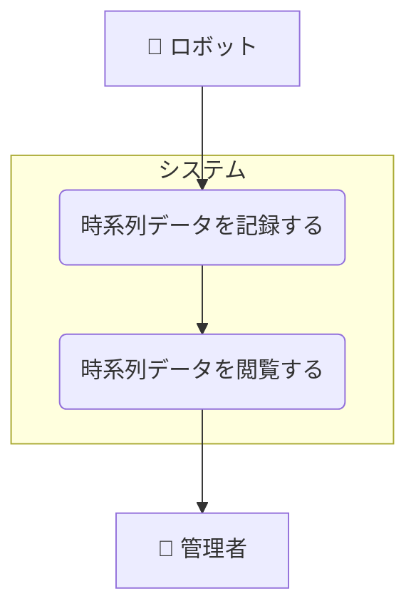

# 情報の管理ユースケース

## ユースケース一覧

| UC ID | ユースケース名         | 説明                                       |
| ----- | ---------------------- | ------------------------------------------ |
| UC3-1 | 時系列データを記録する | ロボットが時系列データをシステムに記録する |
| UC3-2 | 時系列データを閲覧する | 管理者が時系列データを管理画面で閲覧する   |

## ユースケース図

## ユースケース記述

### 概要

管理者は管理画面からロボットの時系列データを閲覧できる。

### アクター

- ロボット
- 管理者

### 基本フロー

1. ロボットが時系列データをシステムに記録する。
2. 管理者が管理画面にアクセスする。
3. システムは選択された時系列データ情報を表示する。

### 代替フロー

- 情報が取得できない場合、エラーメッセージを表示する。
