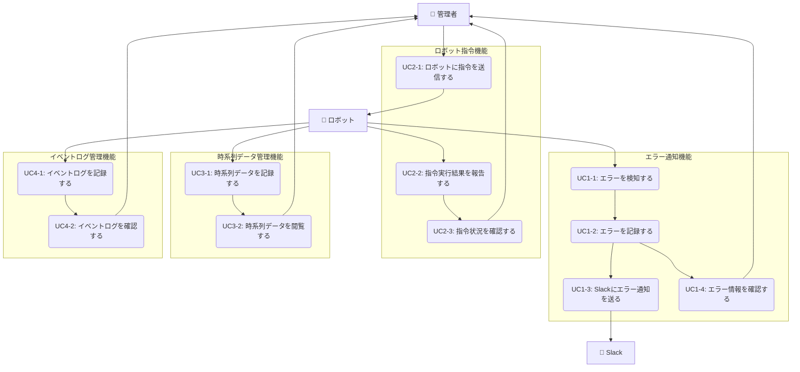

# ロボット管理システム ユースケース概要

## アクター一覧

- **管理者**: 管理画面から指令を出したり情報を閲覧する人
- **ロボット**: 指令に応じて行動し、状態やエラーを返すハードウェア
- **Slack**: システムからの通知を受け取る外部サービス

## 機能別ユースケース一覧

### 1. エラー通知機能（UC1-x）

| UC ID | ユースケース名           | 説明                                         | 詳細                                  |
| ----- | ------------------------ | -------------------------------------------- | ------------------------------------- |
| UC1-1 | エラーを検知する         | ロボットがエラーを検知し、システムに送信する | [詳細](error_notification_usecase.md) |
| UC1-2 | エラーを記録する         | システムがエラー情報をデータベースに記録する | [詳細](error_notification_usecase.md) |
| UC1-3 | Slack にエラー通知を送る | システムが検知したエラーを Slack に通知する  | [詳細](error_notification_usecase.md) |
| UC1-4 | エラー情報を確認する     | 管理者がエラー情報を管理画面で閲覧する       | [詳細](error_notification_usecase.md) |

### 2. ロボット指令機能（UC2-x）

| UC ID | ユースケース名           | 説明                                         | 詳細                             |
| ----- | ------------------------ | -------------------------------------------- | -------------------------------- |
| UC2-1 | ロボットに指令を送信する | 管理者がロボットに行動指令を送信する         | [詳細](robot_command_usecase.md) |
| UC2-2 | 指令実行結果を報告する   | ロボットが指令の実行結果をシステムに報告する | [詳細](robot_command_usecase.md) |
| UC2-3 | 指令状況を確認する       | 管理者が指令の実行状況を管理画面で確認する   | [詳細](robot_command_usecase.md) |

### 3. 時系列データ管理機能（UC3-x）

| UC ID | ユースケース名         | 説明                                       | 詳細                               |
| ----- | ---------------------- | ------------------------------------------ | ---------------------------------- |
| UC3-1 | 時系列データを記録する | ロボットが時系列データをシステムに記録する | [詳細](info_management_usecase.md) |
| UC3-2 | 時系列データを閲覧する | 管理者が時系列データを管理画面で閲覧する   | [詳細](info_management_usecase.md) |

### 4. イベントログ管理機能（UC4-x）

| UC ID | ユースケース名         | 説明                                       | 詳細                                    |
| ----- | ---------------------- | ------------------------------------------ | --------------------------------------- |
| UC4-1 | イベントログを記録する | ロボットがイベントログをシステムに記録する | [詳細](event_log_management_usecase.md) |
| UC4-2 | イベントログを確認する | 管理者がイベントログを管理画面で確認する   | [詳細](event_log_management_usecase.md) |

## 全体ユースケース図

## 機能別ドキュメント

各機能の詳細なユースケース記述は、以下のドキュメントを参照してください：

- [エラー通知ユースケース](error_notification_usecase.md)
- [ロボット指令ユースケース](robot_command_usecase.md)
- [時系列データ管理ユースケース](info_management_usecase.md)
- [イベントログ管理ユースケース](event_log_management_usecase.md)
