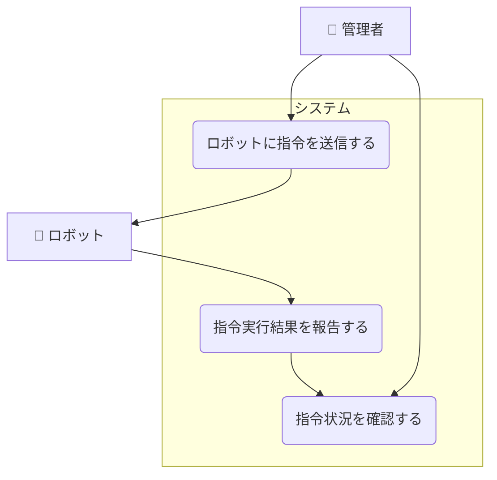

# ロボットへの行動指令ユースケース

## ユースケース一覧

| UC ID | ユースケース名           | 説明                                         |
| ----- | ------------------------ | -------------------------------------------- |
| UC2-1 | ロボットに指令を送信する | 管理者がロボットに行動指令を送信する         |
| UC2-2 | 指令実行結果を報告する   | ロボットが指令の実行結果をシステムに報告する |
| UC2-3 | 指令状況を確認する       | 管理者が指令の実行状況を管理画面で確認する   |

## ユースケース図

## ユースケース記述

### 概要

管理者は管理画面からロボットに対して行動指令（例：充電、巡回、停止など）を送信できる。

### アクター

- 管理者
- ロボット

### 基本フロー

1. 管理者が管理画面からロボットを選択する。
2. 管理者が行動指令（充電、巡回、停止など）を選択し送信する。
3. システムは指令をロボットに送信する。
4. ロボットは指令を受信し、実行を開始する。
5. システムは指令の進捗や完了を管理画面に反映する。

### 代替フロー

- 指令が失敗した場合、エラー通知を表示する。
- 指令の中断や再送信が可能。
